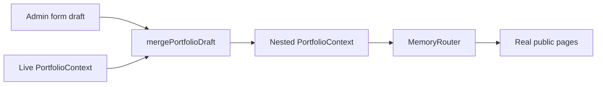

# Admin media, guidance, preview, and motion

Four coordinated upgrades. No new animation libraries (Framer Motion stays for existing page/reveal motion). No schema/migration. No env-file access.

## 1. Reusable media picker

Today [`ImageField`](src/features/admin/fields/ImageField.tsx) only accepts a new file, and callers always mint a unique path (`uploads/${slug}/logo-${Date.now()}-…`). Most assets already live in `portfolio-media`.

**Replace the file-only control with a picker that defaults to reuse:**

- New [`MediaPicker`](src/features/admin/fields/MediaPicker.tsx) (Sheet, since Dialog is not in the UI kit): folder browser matching [`AdminMediaPage`](src/pages/admin/AdminInboxPages.tsx) - `listMediaFiles(prefix)`, breadcrumbs, image thumbnails via `publicMediaUrl`.
- Selecting a file writes the **storage path** into the form. No re-upload.
- Secondary actions: **Upload new** into the current folder (then select it), optional **paste path** for a known storage key.
- Active selection highlighted on the grid.
- [`ImageField`](src/features/admin/fields/ImageField.tsx) becomes: thumbnail + path + **Choose from library** / **Replace with upload** / **Clear**. `onFile` stays for new uploads; add `onPathChange(path: string)`.

Wire into case-study logo/cover/gallery and technology logos in [`AdminCaseStudiesPage.tsx`](src/pages/admin/AdminCaseStudiesPage.tsx) and [`AdminContentPages.tsx`](src/pages/admin/AdminContentPages.tsx). Upload destination when creating a new file stays `uploads/${slug}/…` or `tech/${id}…` as today.

No new table: the library is Storage listing (same 100-item folder page as Media). Resume PDF stays a URL field unless it already uploads; out of scope unless it is an `ImageField`.

## 2. In-place control guidance

[`Field.hint`](src/features/admin/fields/Field.tsx) exists but is used on only two fields. Guidance stays **on the form**, not a docs page.

**Field kit contract**

- `hint` becomes required on `Field`, `SelectField`, `SwitchField`, `StringListField`, `ImageField`, and each `PairListField` inner field (`PairFieldConfig.hint`).
- Hint copy answers: what the value is, where it appears publicly, and what happens if you change/toggle/press it.
- Wire `aria-describedby` from the control to the hint.
- Icon buttons (move/remove/add) get visible `title` + `aria-label` that name the effect (`Remove this gallery image from the case study. Does not delete the file from storage.`).
- [`SaveBar`](src/features/admin/fields/SaveBar.tsx): short captions under Save / Discard / Delete / Preview (`Save writes to the database and becomes public after the next fetch. Discard restores the last saved values.`).
- Case-study tabs: one-line description under the tab row for the active tab.

Copy lives next to each control in the admin pages ([`AdminDashboardPage.tsx`](src/pages/admin/AdminDashboardPage.tsx) profile, case-study editor, [`AdminContentPages.tsx`](src/pages/admin/AdminContentPages.tsx), inbox/media). Dashboard tiles already have short hints; keep those and add titles on nav actions (logout, theme).

## 3. Draft public preview (exact look, isolated router)

Do **not** iframe `/` (that would show **saved** data, run boot, and steal navigation). Do **not** duplicate public markup.

Public pages already read [`usePortfolio()`](src/hooks/usePortfolio.ts). Preview = merge the **unsaved form draft** into a cloned `PortfolioData`, then render the **same page components** inside an isolated tree.

**Shell:** `AdminPreviewOverlay` opened from SaveBar **Preview**. Full-viewport overlay (above Studio), not a cramped split on the already-dense case-study form.

**Isolation**

- Nested `MemoryRouter` so Navbar/card `Link`s stay inside the overlay. The parent `BrowserRouter` never leaves Studio.
- `PreviewModeContext`: skip `Seo`/Helmet (do not rewrite the admin tab title), skip `BootSequence`/`CursorGlow`/Konami, disable [`ContactPanel`](src/features/contact/ContactPanel.tsx) submit.
- Preview chrome: public `Navbar` + `Footer` + page body only (no boot). Banner: `Draft preview - not live until you save.`

**Device frames** (CSS width + `transform: scale`, not layout animation): 390 / 768 / 1280. Scroll inside the frame so hover states still work.

**Admin page → default public path**

| Studio | Preview entry |
|---|---|
| Profile | `/` (picker also `/about`, `/contact`) |
| Case study editor | `/${category}/${slug}` (`platform` → `/platforms/:slug`, etc.) |
| Technologies | `/technology-library` |
| Timeline | `/experience` |
| Philosophy | `/philosophy` |
| Resume | `/resume` |
| Terminal | `/` (commands affect overlay terminal only if opened; default home) |
| Inbox / Media | no Preview button |

Merge helper: replace the edited entity in the cloned `PortfolioData` (profile, one case study by slug, tech/timeline/philosophy/resume arrays). Featured flags, related slugs, and tech usage in the preview follow the draft, not the last save.

Extract public route elements from [`src/app/router.tsx`](src/app/router.tsx) into a shared list so BrowserRouter and MemoryRouter cannot drift.

## 4. Theme dropdown + CSS-first micro-motion

**Theme control** ([`ThemeToggle.tsx`](src/components/theme/ThemeToggle.tsx)): stop cycling on click. Use existing [`DropdownMenu`](src/components/ui/dropdown-menu.tsx) with Light / Dark / System. Trigger shows the **resolved** icon (sun/moon/monitor). Active item: `Check` + `bg-muted` / accent ring. `aria-checked` on the selected item. Keep `theme-icon-in` on icon change. Respect `usePrefersReducedMotion`.

**Motion (design-animate, CSS-first)**

Keep Framer `Reveal` / `PageTransition` / boot. Do **not** add View Transitions on top of them. Do **not** add GSAP/Framer extras.

Add GPU-only CSS in [`src/index.css`](src/index.css) and targeted classes:

- Buttons: `active:scale-[0.97]` via transform (100-150ms ease-out); already have color transitions.
- Theme menu items: 150ms background/transform; trigger icon swap 200ms.
- Admin cards, SaveBar, tab underline: existing hover translate + opacity/transform on tab panel change (`@starting-style` for newly added list rows).
- Media picker / preview overlay: Sheet already animates; add grid-item `@starting-style` opacity+translateY.
- Public: tighten OverlayCard/MagneticButton press feedback; optional CSS scroll-reveal only where `Reveal` is absent (avoid double-animating).
- Loading: reuse/extend skeleton shimmer if Studio loading states are blank.

**Reduced motion:** extend the existing `@media (prefers-reduced-motion: reduce)` block so new keyframes/transitions collapse; keep instant state changes.

Durations under 1000ms. Never animate width/height/top/left/margin/padding.

## Verification

- `npx tsc -b` and oxlint on touched files.
- Browser on port **8000** if already running (do not start a second Vite): media pick reuse, hints on a dense form, preview of a case-study draft vs saved, theme dropdown + active highlight, reduced-motion sanity.
- Do not bind 3000/5173.
