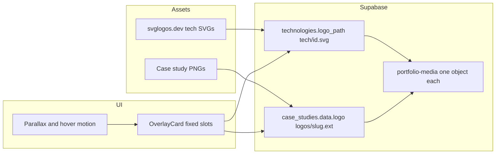

# Fixed Cards, Logo Dedupe, Motion

## Locked decisions

- **Cards:** All `OverlayCard` usages (case studies, tech library, philosophy, engineering areas/stats, about, home experience, contact, resume chips) - not `SurfaceCard` content panels (forms/detail sections keep fluid height).
- **Logos:** Tech/brand marks from [svglogos.dev](https://svglogos.dev/); case-study marks stay as **PNG (or existing raster) in Supabase**; **dedupe** so each logo exists once under a stable path.

## 1. OverlayCard redesign (fixed size, no blank-gap feel)

**Problem today:** grids use `auto-rows-fr` + `h-full` + `flex: 1` body ([`src/lib/utils.ts`](src/lib/utils.ts), [`src/index.css`](src/index.css) `.overlay-card__bottom`), so short content stretches into empty space.

**Approach:** Replace stretch-fill with a **fixed-height, slot-based card**.

Rewrite [`src/components/cards/OverlayCard.tsx`](src/components/cards/OverlayCard.tsx) + overlay CSS in [`src/index.css`](src/index.css):

- **Variants with explicit heights** (CSS custom properties), e.g.:
  - `--card-h` standard grid card (~22-24rem)
  - featured / wide uses a second fixed height (not stretch-to-neighbor)
  - compact (tech/stat) slightly shorter
- **Internal CSS grid / reserved zones** (always present, same size):
  1. Banner / logo stage (fixed)
  2. Title (fixed lines, `line-clamp-2`)
  3. Stats strip (fixed height; empty slots stay as invisible placeholders so layout never collapses)
  4. Body (fixed height + `line-clamp` on summary)
  5. Meta row (tech logos / CTAs) with fixed chip row height
- Drop “grow into blank” (`flex: 1` filler). Overflow clips or clamps - never uneven empty panels between siblings.
- Keep theme language: electric blue / soft cyan / deep purple gradients ([`src/lib/cardGradients.ts`](src/lib/cardGradients.ts)), Space Grotesk titles, mono eyebrows, frosted logo plate - but **new composition** (forget current notch-heavy imbalance as the hero of the design; simplify shell to a cleaner engineering-portfolio card that still feels on-brand).
- Update consumers that assume free-form body height: [`CaseStudyCard.tsx`](src/features/case-studies/CaseStudyCard.tsx), [`TechnologyLibraryGrid.tsx`](src/features/technology-library/TechnologyLibraryGrid.tsx), [`PhilosophyGrid.tsx`](src/features/philosophy/PhilosophyGrid.tsx), [`EngineeringAreas.tsx`](src/features/home/EngineeringAreas.tsx), [`EngineeringStats.tsx`](src/features/home/EngineeringStats.tsx), [`HomeSections.tsx`](src/features/home/HomeSections.tsx), [`AboutPage.tsx`](src/pages/AboutPage.tsx), [`ContactPanel.tsx`](src/features/contact/ContactPanel.tsx), [`ResumePreview.tsx`](src/features/resume/ResumePreview.tsx).
- Grid helpers stay equal columns; cards no longer rely on row stretching to look finished.

Skills: `frontend-design`, `ui-styling`, `tailwind-css-patterns`, `accessibility` (focus rings, contrast, clamp without cutting critical labels).

## 2. Supabase storage dedupe (new migration only)

**Root cause of duplicates:** admin case-study upload uses timestamped keys:

```194:194:src/pages/admin/AdminCaseStudiesPage.tsx
const dest = `uploads/${study.slug || 'draft'}/${kind}-${Date.now()}-${file.name}`;
```

Tech uploads already use stable `tech/{id}{ext}`; MediaPicker can also stamp `uploads/{Date.now()}-…`.

**Canonical paths (one object per logo):**

| Kind | Path |
|------|------|
| Case study logo | `logos/{slug}.{ext}` |
| Tech logo | `tech/{id}.svg` (or existing ext) |
| Cover / gallery | keep separate prefixes; only logo paths are deduped in this pass |

**New migration** via `npx supabase migration new dedupe_portfolio_media_logos` (append-only; never edit [`20260827194842_portfolio_schema.sql`](supabase/migrations/20260827194842_portfolio_schema.sql)):

1. For each known slug/id, **copy** the newest matching object in `storage.objects` (`bucket_id = 'portfolio-media'`) into the canonical key if missing (SQL `insert … select` on `storage.objects` metadata, or use `storage.copy` if available in your Supabase version - prefer object-table move/copy patterns already supported).
2. **Rewrite references:**
   - `technologies.logo_path` → `tech/{id}.svg` (or current stable ext)
   - `case_studies.data` JSON `logo` (and any logo URLs under `uploads/…` that match that study) → `logos/{slug}.{ext}`
3. **Delete** orphan/duplicate logo objects under `logos/`, `tech/`, and `uploads/**/logo-*` that are not the canonical path.
4. Document that after `db:push`, run a one-shot re-upload only if a canonical file is missing on remote (seed already upserts stable paths in [`scripts/seed-portfolio.ts`](scripts/seed-portfolio.ts)).

**Prevent re-dupes (code, not old migrations):**

- Change [`AdminCaseStudiesPage.tsx`](src/pages/admin/AdminCaseStudiesPage.tsx) logo upload to `logos/{slug}{ext}` with `upsert: true`.
- Keep MediaPicker “link existing” behavior; prefer picker over re-upload for logos.
- Optional: small admin hint when selecting an existing `logos/` / `tech/` object.

Apply with `npm run db:push` (remote) / `npm run db:reset` (local) per project norms.

## 3. Brand SVGs from svglogos.dev

Replace every file under [`src/assets/tech/`](src/assets/tech/) used by [`src/content/technologies.ts`](src/content/technologies.ts) with official SVGs downloaded from [svglogos.dev](https://svglogos.dev/) (kebab-case filenames, same import paths where possible).

- Map: react, typescript, javascript, supabase, postgresql, mongodb, azure, microsoft / microsoft365, docker, linux, truenas, n8n, sharepoint, outlook, git, github, githubactions, openapi, etc.
- **Do not** replace Lucide UI icons (`ArrowUpRight`, area icons) - rule covers brand/product logos only.
- **Case study rasters** (`navdrishti`, `brainpulses`, `NGI`, etc.) stay PNG; local [`src/assets/logos/`](src/assets/logos/) remain seed sources; remove unused duplicates locally only if unused after cleanup (e.g. extra n8n variants) without breaking imports.
- After local SVG swap, seed/re-upload **one** `tech/{id}.svg` per technology into Supabase so runtime DB paths match.

## 4. Animations + parallax

Build on existing `framer-motion` ([`src/lib/motion.ts`](src/lib/motion.ts), [`Reveal`](src/components/shared/Reveal.tsx)) and CSS motion ([`BackgroundEffects`](src/components/effects/BackgroundEffects.tsx)). Skills: `design-animate` + reduced-motion via `usePrefersReducedMotion` / `useReducedMotion`.

Concrete motion set (2-3 intentional systems, not noise):

1. **Scroll parallax layers** on home/hero and card banners (`useScroll` + `useTransform` on gradient plate / logo stage; CSS `transform: translate3d` only).
2. **Card entrance + hover depth:** staggered `Reveal` already present; add subtle 3D tilt or magnetic lift on OverlayCard hover (pointer-driven, capped, disabled when reduced motion).
3. **Section atmosphere:** slow parallax on grid/blobs behind featured grids; optional scroll-linked opacity on section headers.

No new animation library unless a gap appears; prefer GPU transforms, ≤600ms entrances, respect `prefers-reduced-motion`.

## 5. Verification

- `npx tsc -b` clean; oxlint on touched files if project skill requires.
- Visual check: home, case study grids, tech library - sibling cards same outer size; short vs long summaries don’t leave empty “dead” panels.
- Confirm one storage object per logo after migration + admin re-upload path uses upsert.
- Reduced-motion: parallax/tilt off.


