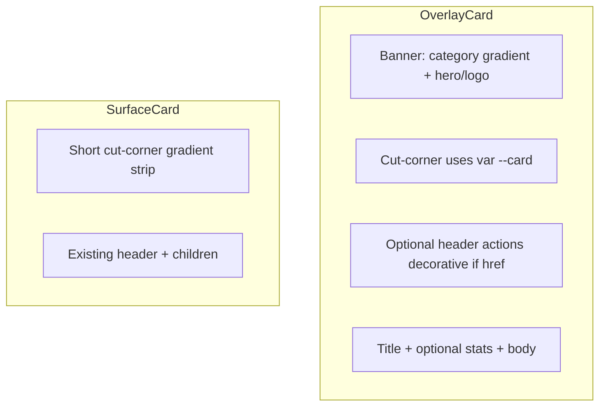

# Cut-corner overlay cards

## What we are borrowing

The reference is a **compact promo tile**: opaque navy shell, cyan gradient banner with a **skewed cut-corner**, icon row in the notch, title and a 3-column meta row below. That silhouette is what makes it feel minimal and finished.

We will **not** clone its content (Uiverse logo, Instagram/Twitter/Discord, fake stats) or its 230px width. Portfolio tiles stay fluid in the existing grids ([`responsiveCardGridClassName`](src/lib/utils.ts) and siblings).



## Lessons from the theme switch (apply here)

| Pitfall | Card rule |
|---|---|
| `styled-components` | Do **not** add it. Port geometry into React + scoped CSS in [`src/index.css`](src/index.css), same as `.theme-switch`. |
| Hardcoded `#1b233d` / white | Cut-corner fill **must** equal the card fill. Use `var(--card)` (already light `#ffffff` / dark `#111827`). Gradients stay on [`cardGradients.ts`](src/lib/cardGradients.ts) (`--electric-blue`, `--soft-cyan`). Text uses `foreground` / `muted-foreground`. |
| Semi-transparent `bg-card/70` + blur | The notch trick is **solid**. OverlayCard shell becomes **opaque** `bg-card` (drop glass on overlay tiles). Mismatch vs page glow is expected; a translucent card with a solid notch looks broken in both themes. |
| `zoom` for sizing | Theme switch needed `zoom` to shrink a 169px control. Cards stay **fluid**; banner height via `em` / `%` / `min-height`, not `zoom` or a fixed 130px notch on every breakpoint. |
| Do not change call-site wrappers | Keep [`OverlayCard`](src/components/cards/OverlayCard.tsx) / [`SurfaceCard`](src/components/cards/SurfaceCard.tsx) props. Do not rewrite Navbar-style `className` on every page. Migrate internals; add optional `stats` / `headerActions`. |
| Nested interactives | If `href` is set, the shell is a `<Link>`. Header icons and stats are **not** separate links. Nested `<a>` already exist in [`ContactPanel.tsx`](src/features/contact/ContactPanel.tsx) (no `href` on the card) and [`TechnologyLibraryGrid.tsx`](src/features/technology-library/TechnologyLibraryGrid.tsx) — keep those cards as `<article>`. |
| Hover `scale(1.05)` | Clips in CSS grids and feels jumpy. Keep current **small lift** (`translateY` + border glow), wrap hover in `@media (hover: hover)`, honor `prefers-reduced-motion`. |
| Portals / Radix menus | Not used. Do not introduce them on cards. |
| Title on a dark scrim | Today title sits **on** the hero ([`overlay-hero-scrim`](src/index.css)), which fights logos and numbers. Move title **below** the banner like the reference. Remove or stop using `.overlay-hero-scrim` on OverlayCard. |

## OverlayCard layout

Replace the 4/3 + bottom-scrim stack with:

1. **Shell** — `rounded-[20px]`, `p-1`, `overflow-hidden`, `bg-card`, `border-border/80`.
2. **Banner** (`overlay-card__banner`) — existing `getCardGradient(gradient)`; height ~9.5rem default, taller when `featured` (not a huge 16/10 letterbox). `position: relative`.
3. **Cut-corner** — port the skew + `::before` concave joins. Notch background and box-shadows use `var(--card)` so light/dark both read as one piece. Size with `%` / `em` so featured / 2-col cards do not look like a 130px sticker.
4. **Header row** — eyebrow (left, like the “logo” slot) + optional `headerActions` (right). Default for `href` cards: keep the existing `ArrowUpRight` affordance (visible on hover/focus, always visible on touch via `@media (hover: none)`).
5. **Hero** — centered in the remaining banner (logo, icon, big number). No title overlay.
6. **Bottom** — title (centered, tracking, `font-display`); optional `stats` row (flex, muted cyan-tinted `color-mix` with `--soft-cyan`, dividers on middle items); then existing `body` / `footer`.

New optional prop:

```ts
stats?: { value: string; label: string }[];
headerActions?: ReactNode;
```

Do **not** invent three fake numbers on every card. Only pass `stats` where data exists.

## Call-site mapping (same files, small prop adds)

| Consumer | Banner | Bottom |
|---|---|---|
| [`CaseStudyCard.tsx`](src/features/case-studies/CaseStudyCard.tsx) | Logo; eyebrow = category | Title; `stats` from timeline, status, tech count; body = clamped summary + tech icons (keep icons here, not as fake socials) |
| [`EngineeringStats.tsx`](src/features/home/EngineeringStats.tsx) | Counter stays in `hero` | Title + description body; **no** 3-stat row |
| [`EngineeringAreas.tsx`](src/features/home/EngineeringAreas.tsx) | Pillar icon | Title; body description/examples; drop redundant “Explore” text if the card is already a link |
| [`PhilosophyGrid.tsx`](src/features/philosophy/PhilosophyGrid.tsx) / [`AboutPage.tsx`](src/pages/AboutPage.tsx) | Index glyph | Title + prose body |
| [`HomeSections.tsx`](src/features/home/HomeSections.tsx) | Empty or small glyph | Title + detail |
| [`TechnologyLibraryGrid.tsx`](src/features/technology-library/TechnologyLibraryGrid.tsx) | Tech logo | Title + description + “Used in” links (article, not Link) |
| [`ContactPanel.tsx`](src/features/contact/ContactPanel.tsx) OverlayCard | Mail icon | Title + channel links (article) |
| Resume mini [`OverlayCard`](src/features/resume/ResumePreview.tsx) | Existing hero | Title + body |

Grids, featured `md:col-span-2`, and Reveal wrappers stay as they are.

## SurfaceCard (chrome only)

Keep forms and long sections as panels. Align visually:

- Same outer radius / padding / **opaque** `bg-card` as OverlayCard (can drop extra `backdrop-blur-xl` here too).
- Replace the 1px gradient hairline with a **short** cut-corner banner strip (same CSS primitive, smaller height ~2.5rem) when `gradient` is set, then existing `header` / `title` / `children`.
- No stats row, no whole-card `href`, no hero logo.

## CSS placement

Add a scoped block in [`src/index.css`](src/index.css) (e.g. `.overlay-card`, `.overlay-card__banner`, `.overlay-card__notch`) with:

- Theme tokens only for notch / type / borders.
- `@media (hover: hover)` for icon fill / lift.
- Reduced-motion: no scale/skew animation (geometry can stay static).
- Delete unused `.overlay-hero-scrim` if OverlayCard is the only consumer.

Keep gradient meshes in [`cardGradients.ts`](src/lib/cardGradients.ts); do not hardcode `rgb(4, 159, 187)`.

## Out of scope

- shadcn [`card.tsx`](src/components/ui/card.tsx) (unused on public pages).
- Admin Studio table chrome.
- New social icons on project cards.
- Content/data changes.

## Verification (this is how the toggle slipped)

- Light **and** dark: notch color matches card body on Home, Platforms, About, Philosophy, Technology, Resume, Contact, one case-study **detail** (SurfaceCard strip).
- Mobile ~375px: single column, no horizontal overflow, tap targets, no hover-only title.
- Featured home card: notch scales; no clipped scale.
- Keyboard: focus ring on `href` cards; Contact/Technology inner links still work.
- `prefers-reduced-motion`: no lift animation.
- `npx tsc -b` + oxlint on touched files. Browser pass on existing `:8000` (do not start a second Vite).
