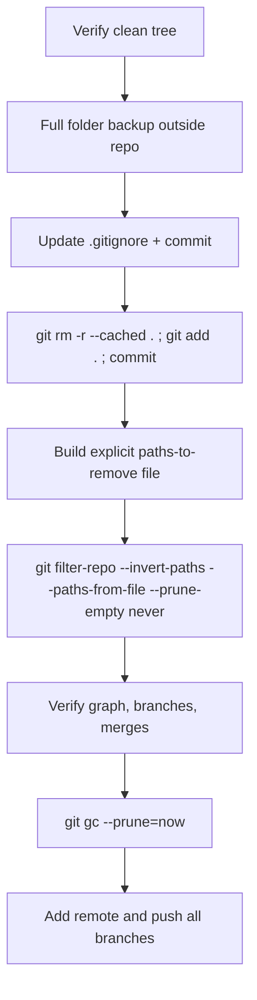

## Current state (verified)

- `.github/workflows/deploy.yml` already exists: `workflow_dispatch` only, with a `ref` input, and it already passes `VITE_SUPABASE_URL` / `VITE_SUPABASE_ANON_KEY` / `VITE_ADMIN_BASE_PATH` from `secrets` into `npm run build`. It needs small hardening, not a rewrite.
- `vite.config.ts` uses `loadEnv(mode, process.cwd(), 'VITE_')` and hard-fails a prod build if the Supabase URL/key are missing. `loadEnv` merges `process.env` VITE_* values, so CI secrets work without any `.env.prod` file present.
- No git remote is configured yet. Branches: `main`, `admin_panel`, `ui/cards`, `updates`, `v3`. Working tree is clean.
- Ignored-but-in-history paths: `.cursor/**` (21 plans + 48 rules), `docs/**` (prompts, resume PDF/TEX, deployment.md), `skills-lock.json`, `.cursorignore`. `node_modules`, `dist`, and real `.env*` files were never committed (only `.env.example`, which stays tracked).
- `git-filter-repo` is not installed; Python 3.12 + pip are available.

## 1. `.gitignore` hardening

Update [.gitignore](.gitignore) so only shippable source reaches the remote. Keep existing entries and add:

```gitignore
# Tooling / local-only
.agents/
.cursor/
.cursorignore
skills-lock.json
.claude/
coverage
*.tsbuildinfo
stats.html

# Supabase local artifacts
supabase/.branches/
supabase/.temp/
```

Explicitly keep tracked: `src/`, `public/`, `scripts/`, `supabase/migrations/`, `supabase/config.toml`, `.github/`, `index.html`, `README.md`, `.env.example`, all `tsconfig*.json`, `vite.config.ts`, `package.json`, `package-lock.json`, `components.json`, `.oxlintrc.json`, `.prettierrc`, `.prettierignore`.

Per your choice, `docs/` stays fully ignored and gets scrubbed, so `docs/deployment.md` becomes local-only. I will move the essential deploy steps (Pages source = GitHub Actions, required secrets, how to run the manual workflow) into a short "Deployment" section of [README.md](README.md) so the remote still documents itself.

Also delete the stale root `404.html` (the real one is generated into `dist/` by `scripts/copy-spa-fallback.mjs`).

## 2. Deployment workflow polish

Edits to [.github/workflows/deploy.yml](.github/workflows/deploy.yml), keeping it manual-only:

- Add `environment: production` at the build step level via `vars`/`secrets` scoping so GitHub *Environment* secrets (not just repo secrets) resolve. Concretely, set the job to use the `github-pages` environment (already there) and read secrets from it; you add `VITE_SUPABASE_URL`, `VITE_SUPABASE_ANON_KEY`, `VITE_ADMIN_BASE_PATH` under Settings → Environments → `github-pages` → Environment secrets.
- Add a pre-build guard that fails fast with a clear message if `VITE_SUPABASE_URL` or `VITE_SUPABASE_ANON_KEY` is empty, instead of a cryptic Vite throw.
- Add `npm run lint` and `tsc -b` gating before build (build already runs `tsc -b`).
- Drop the duplicate `cp dist/index.html dist/404.html` step since `postbuild` already does it, or keep it as an idempotent safety net — I will keep one and remove the other.
- `concurrency: pages` with `cancel-in-progress: false` so a deploy in flight is not killed.

No `push:` trigger is added anywhere — deploys stay manual via Actions → Run workflow → `ref`.

## 3. Supabase cloud flexibility

- Keep `.env.dev` / `.env.local` for local dev and `.env.prod` for local prod builds (loaded by [scripts/load-app-env.ts](scripts/load-app-env.ts) and Vite's `envDir`).
- In CI there is no `.env.prod`; the GitHub environment secrets flow straight into `process.env` and Vite picks them up. Nothing to change in [src/lib/env.ts](src/lib/env.ts).
- Update [.env.example](.env.example) with a comment block listing the exact secret names to create in the GitHub environment, so local and cloud stay in sync.
- `npm run db:push` / `db:seed:prod` remain manual local operations against the cloud project — no service-role key ever enters CI.

## 4. History scrubbing (cautious, topology-preserving)



Key deviations from [docs/Git History Cleanup.md](docs/Git%20History%20Cleanup.md), for safety:

- **Do not** generate the path list from `git status --ignored`. That lists thousands of `node_modules` entries and would name your real `.env.dev` file. Instead I build the list from what is *actually present in history*, which is a short, auditable set: `.cursor/`, `docs/`, `skills-lock.json`, `.cursorignore`, `404.html`.
- Use `--prune-empty never` so commits that only touched `.cursor/plans/*` are **not** dropped. This keeps commit count, branch tips, and merge topology identical.
- Install the tool first: `pip install git-filter-repo` (Python 3.12 present).
- `git-filter-repo` refuses to run on a repo with a remote or a non-fresh clone; since there is no remote yet it will run, possibly needing `--force`. I will use `--force` only after the physical backup exists.
- Branches `admin_panel`, `ui/cards`, `updates`, `v3`, `main` are all rewritten in place — none deleted, none re-parented.

Verification after the rewrite: `git log --all --graph --oneline` compared against a pre-rewrite capture, plus `git log --all --name-only | Select-String '^docs/|^\.cursor/'` returning nothing, and `git branch -a` showing the same five branches.

## 5. Remote setup (last step, only after you confirm verification)

`git remote add origin ...`, `git push -u origin main`, then push the other branches. Then in GitHub: Settings → Pages → Source = GitHub Actions; Settings → Environments → `github-pages` → add the three `VITE_*` secrets.

## Risks

- History rewrite changes every commit SHA. Acceptable since there is no remote yet and no other clone.
- The physical backup copy is mandatory before Phase 4 and I will not proceed without confirming it exists.