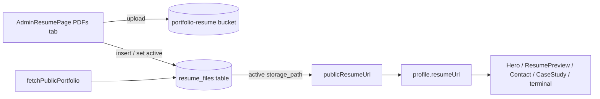

# Multi-Resume via Supabase Storage

## Current state

The download URL is already resolved from Storage at fetch time - the DB stores a bare key and [src/services/portfolio-public.ts](src/services/portfolio-public.ts) converts it:

```ts
profile.resumeUrl = publicResumeUrl(
  profile.resumeUrl.replace(/^\/+/, '') || 'resume.pdf'
);
```

The `portfolio-resume` bucket already exists with public read, admin-only writes, PDF-only MIME and a 20 MB cap (lines 202-239 of [supabase/migrations/20260827194842_portfolio_schema.sql](supabase/migrations/20260827194842_portfolio_schema.sql)). `uploadPortfolioFile()` in [src/services/portfolio-admin.ts](src/services/portfolio-admin.ts) already accepts `RESUME_BUCKET`.

What is missing: a list of resumes, an active selection, an admin UI, and removal of the repo copy.

## Data flow after the change



## 1. New migration

Create via `npx supabase migration new resume_files` (never edit the existing migration).

```sql
create table public.resume_files (
  id uuid primary key default gen_random_uuid(),
  label text not null,
  storage_path text not null unique,
  is_active boolean not null default false,
  size_bytes bigint,
  created_at timestamptz not null default now(),
  updated_at timestamptz not null default now()
);

create unique index resume_files_single_active
  on public.resume_files (is_active) where is_active;

alter table public.resume_files enable row level security;
```

Policies mirror the existing pattern: `Public read resume_files` for `anon, authenticated` using `true`, and `Admin write resume_files` for all using / with check `private.is_admin()`.

Add a `set_active_resume(target uuid)` security-definer function guarded by `private.is_admin()` that clears `is_active` then sets the target in one transaction - the partial unique index otherwise rejects a naive two-step update.

## 2. Public fetch

In [src/services/portfolio-public.ts](src/services/portfolio-public.ts):
- Make `resumeUrl` optional in `profileSchema` (it stops being authored content).
- Add `supabase.from('resume_files').select('storage_path').eq('is_active', true).maybeSingle()` to the existing `Promise.all` batch.
- Set `profile.resumeUrl = row ? publicResumeUrl(row.storage_path) : ''`.

Keeping the derived `profile.resumeUrl` field means the five consuming sites need no signature changes.

## 3. Empty-state handling

With no local fallback, `resumeUrl` can legitimately be empty. Guard the CTA in each consumer so an empty string never renders a dead link:
- [src/features/hero/HeroSection.tsx](src/features/hero/HeroSection.tsx) line 64
- [src/features/resume/ResumePreview.tsx](src/features/resume/ResumePreview.tsx) lines 155 and 401 (also the surrounding "Want the full PDF?" block)
- [src/features/contact/ContactPanel.tsx](src/features/contact/ContactPanel.tsx) line 94
- [src/features/case-studies/CaseStudyPage.tsx](src/features/case-studies/CaseStudyPage.tsx) line 380
- [src/content/terminal.ts](src/content/terminal.ts) lines 321 and 473 - print a "no resume published" message instead of an empty URL

## 4. Admin service functions

Add to [src/services/portfolio-admin.ts](src/services/portfolio-admin.ts) and re-export from [src/services/portfolio.ts](src/services/portfolio.ts):
- `listResumeFiles()` - ordered by `created_at desc`
- `uploadResumeFile(label, file)` - upload to `RESUME_BUCKET` under a unique key (`${Date.now()}-${slug}.pdf`, avoiding CDN staleness from key reuse), then insert the row; mark active automatically if it is the first one
- `setActiveResumeFile(id)` - RPC to `set_active_resume`
- `renameResumeFile(id, label)`
- `deleteResumeFile(id)` - remove the storage object and the row; block deleting the active file unless another is promoted first

## 5. Admin UI

Add a `PDFs` entry to `resumeTabs` in [src/pages/admin/AdminContentPages.tsx](src/pages/admin/AdminContentPages.tsx) (line 654) rendering a new `ResumeFilesPanel` component under `src/features/admin/`. It manages its own React Query state rather than the `ResumeData` draft, since uploads apply immediately rather than through `SaveBar`.

The panel: a drag/drop upload label with `accept="application/pdf"` plus a label input, and a list of rows showing label, filename, size, upload date, an active radio, and rename/delete/open actions. The upload affordance can follow the dashed-border pattern in [src/features/admin/fields/MediaPicker.tsx](src/features/admin/fields/MediaPicker.tsx) (lines 112-127). Invalidate `portfolioQueryKey` after any mutation so the public preview updates.

## 6. Remove the local copy

- Delete `public/resume.pdf`.
- Drop `resumeUrl` from `src/content/profile.ts` (line 20) - it is seed-only content, not runtime.
- Delete `seedResumePdf()` and its call from [scripts/seed-portfolio.ts](scripts/seed-portfolio.ts) (lines 197-212), and drop `resumeUrl: 'resume.pdf'` from the profile payload (line 247). Resumes are uploaded through the admin UI, not seeded.
- Remove `resumeUrl` from the `Profile` type in [src/types/portfolio.ts](src/types/portfolio.ts) only if it is separated from the derived field; otherwise keep it and document that it is populated at fetch time.

## Verification

`npx tsc -b`, then check `/`, `/resume`, `/contact` and a case study with zero resumes uploaded (no dead buttons), then upload two PDFs and confirm switching the active one changes every download link.

## Note

Deleting `public/resume.pdf` removes it going forward, but the file stays in git history. `docs/Git History Cleanup.md` is the place to handle that separately if you want it purged.