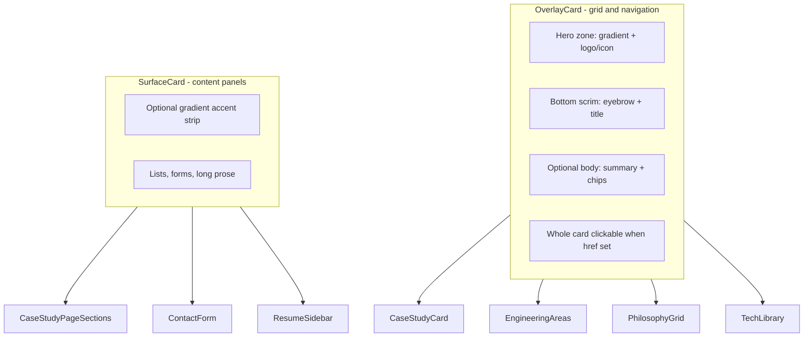

# Overlay Card System Redesign

## Why the current design feels off

The existing cards ([`CaseStudyCard.tsx`](src/features/case-studies/CaseStudyCard.tsx), [`EngineeringAreas.tsx`](src/features/home/EngineeringAreas.tsx), etc.) share the same vertical stack:

```text
[ 16:9 logo banner - often empty for small logos ]
[ 4 metadata badges in a row ]
[ Title → Summary ]
[ Boxed TechBanner ]
[ Separate CTA button ]
```

Problems vs reference portfolios ([adityacprtm.dev](https://adityacprtm.dev/portfolio), [vcard portfolio](https://codewithsadee.github.io/vcard-personal-portfolio/)):

- **Visual hierarchy is flat** - logo banner, badges, and CTA compete equally
- **Large logo frame wastes space** - logos float in a empty 16:9 letterbox
- **Not scannable** - too much metadata before the title
- **Not portfolio-native** - references use image-forward tiles with overlay text and whole-card click, not boxed CTAs
- **Same hover pattern everywhere** - `glass` + `-translate-y-1` on every surface

You chose: **all card surfaces** + **image-forward overlay layout**.

---

## Design system: two card primitives



### 1. `OverlayCard` (new)

Add [`src/components/cards/OverlayCard.tsx`](src/components/cards/OverlayCard.tsx):

| Zone | Behavior |
|------|----------|
| **Hero** | `aspect-[4/3] sm:aspect-[16/10]`; category-tinted gradient mesh background; centered logo/icon/image (`object-contain`, max 55% height) |
| **Scrim** | Absolute bottom gradient (`from-background/95 via-background/60 to-transparent`); always shows eyebrow + title (mobile-safe - no hover-only info) |
| **Body** | Optional slot below hero: `line-clamp-2` summary, inline tech icons, meta chips |
| **Interaction** | Wraps in `Link` when `href` passed; `ArrowUpRight` corner icon on hover/focus; `hover:border-primary/50`, subtle `scale-[1.01]`, `motion-reduce` safe |
| **Variants** | `default`, `featured` (taller hero, `md:col-span-2` support via prop) |

Shared gradient tokens in [`src/lib/cardGradients.ts`](src/lib/cardGradients.ts) keyed by category (`platform`, `infrastructure`, `automation`, `philosophy`, `about`, `stat`, etc.) using existing palette (`electric-blue`, `deep-purple`, `soft-cyan`).

### 2. `SurfaceCard` (new)

Add [`src/components/cards/SurfaceCard.tsx`](src/components/cards/SurfaceCard.tsx):

- Same outer shell: `rounded-2xl`, `ring-1 ring-foreground/10`, `bg-card/70`, `backdrop-blur-xl`
- Optional thin gradient top border accent (matches category when provided)
- Standard `header` + `children` slots - for forms, resume sidebar, case-study section panels
- **Not** full-card clickable

Add utility class in [`src/index.css`](src/index.css):

```css
.overlay-hero-scrim {
  background: linear-gradient(to top, rgb(5 8 22 / 0.95) 0%, rgb(5 8 22 / 0.55) 45%, transparent 100%);
}
```

---

## Component migrations

### Priority 1 - Case study cards (biggest visual win)

Refactor [`CaseStudyCard.tsx`](src/features/case-studies/CaseStudyCard.tsx):

- Replace shadcn `Card` + `LogoFrame variant="card"` + `Button` CTA with `OverlayCard`
- Hero: project logo on category gradient
- Scrim: `{categoryLabels[study.category]}` + `{study.name}`
- Body: 2-line `summary`, compact tech icon row (reuse `TechBadge compact`, drop boxed `TechBanner` border)
- Meta: single row - `timeline` + `status` as small pills (drop redundant difficulty/category duplication in body)
- Pass `featured={study.featured}` for home grid

Update [`HomePage.tsx`](src/pages/HomePage.tsx) grid:

```tsx
// featured study spans 2 cols on md+
className="grid min-w-0 grid-cols-1 gap-5 md:grid-cols-2 [&>*]:min-w-0 [&>.featured]:md:col-span-2"
```

[`CaseStudyGrid.tsx`](src/features/case-studies/CaseStudyGrid.tsx) and related studies section inherit via `CaseStudyCard` only.

Deprecate `LogoFrame` `card` variant usage (keep `header` / `gallery` / `lightbox`).

---

### Priority 2 - Home & category navigation cards

| File | Overlay treatment |
|------|-------------------|
| [`EngineeringAreas.tsx`](src/features/home/EngineeringAreas.tsx) | Icon (Cpu/Cloud/Workflow) as hero glyph on pillar gradient; scrim = area title; body = description + examples; whole card links to `/platforms` etc. |
| [`EngineeringStats.tsx`](src/features/home/EngineeringStats.tsx) | Animated counter large in hero; scrim = stat label; body = description |
| [`HomeSections.tsx`](src/features/home/HomeSections.tsx) `ExperienceSnapshot` | Overlay tiles: title on scrim, detail in body |
| [`PhilosophyGrid.tsx`](src/features/philosophy/PhilosophyGrid.tsx) | Hero = gradient + `0{n}` mono index; scrim = pillar title; body = summary + detail (detail `line-clamp-3` on mobile) |
| [`AboutPage.tsx`](src/pages/AboutPage.tsx) | Hero = abstract gradient per section index; scrim = section title; body = prose |
| [`TechnologyLibraryGrid.tsx`](src/features/technology-library/TechnologyLibraryGrid.tsx) | Hero = tech logo (from `TechBadge` asset); scrim = tech name; body = description + linked case-study chips |

---

### Priority 3 - SurfaceCard for content-heavy panels

| File | Treatment |
|------|-----------|
| [`CaseStudyPage.tsx`](src/features/case-studies/CaseStudyPage.tsx) | Replace 7× `Card className="glass"` section wrappers with `SurfaceCard` (Responsibilities, Decisions, Challenges, Stack, Gallery wrapper, Outcome, etc.) |
| [`ContactPanel.tsx`](src/features/contact/ContactPanel.tsx) | Channels panel → `OverlayCard` with Mail icon hero; form panel → `SurfaceCard` (inputs must stay interactive) |
| [`ResumePreview.tsx`](src/features/resume/ResumePreview.tsx) | Profile sidebar + Professional Summary → `SurfaceCard` with gradient header strip; highlight mini-tiles → compact `OverlayCard`; expertise group articles → `SurfaceCard` |
| [`HomePage.tsx`](src/pages/HomePage.tsx) bottom CTA | Keep as full-width banner (not overlay) - already distinct |

---

## Responsive behavior

| Breakpoint | OverlayCard |
|------------|-------------|
| **320-639px** | Single column; hero `aspect-[4/3]`; scrim always visible; no hover-only content; full-card tap target min 44px |
| **640px+** | Hero `aspect-[16/10]`; hover lift + border glow + corner arrow |
| **768px+** | Grids stay 2-col (case studies) / 3-col (areas, stats); featured card spans 2 cols on home |
| **1024px+** | No layout change; ensure `min-w-0` on all grid children (existing utilities preserved) |

Remove redundant patterns globally: `-translate-y-1` on old glass cards, separate CTA buttons on navigational cards, boxed `TechBanner` wrapper on case study cards.

---

## Files to create / change

| Action | Path |
|--------|------|
| **Create** | `src/components/cards/OverlayCard.tsx` |
| **Create** | `src/components/cards/SurfaceCard.tsx` |
| **Create** | `src/lib/cardGradients.ts` |
| **Update** | `src/index.css` - scrim utility, optional `--overlay-hero-min-height` |
| **Rewrite** | `src/features/case-studies/CaseStudyCard.tsx` |
| **Update** | `src/pages/HomePage.tsx` - featured grid span |
| **Update** | `src/features/home/EngineeringAreas.tsx` |
| **Update** | `src/features/home/EngineeringStats.tsx` |
| **Update** | `src/features/home/HomeSections.tsx` |
| **Update** | `src/features/philosophy/PhilosophyGrid.tsx` |
| **Update** | `src/pages/AboutPage.tsx` |
| **Update** | `src/features/technology-library/TechnologyLibraryGrid.tsx` |
| **Update** | `src/features/case-studies/CaseStudyPage.tsx` |
| **Update** | `src/features/contact/ContactPanel.tsx` |
| **Update** | `src/features/resume/ResumePreview.tsx` |
| **Trim** | `src/components/media/LogoFrame.tsx` - remove unused `card` variant |

**Out of scope:** Content/data changes, new screenshot assets, filter chips like adityacprtm (can be a follow-up).

---

## Verification

1. `npm run build` - no TS/lint regressions
2. Visual pass at **320 / 375 / 768 / 1024px** on `/`, `/platforms`, `/about`, `/philosophy`, `/technology`, `/resume`, `/contact`, one case study detail
3. Confirm: whole-card navigation works (keyboard + screen reader `aria-label`), no horizontal overflow, logos readable in hero (not letterboxed in empty 16:9 block)
