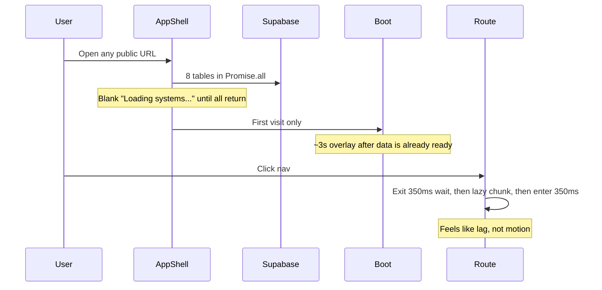

# Performance and public-site motion

## What is actually happening

This is not an empty motion stack. Framer Motion is already a dependency, [`Reveal`](src/components/shared/Reveal.tsx) wraps most public sections, [`HeroSection`](src/features/hero/HeroSection.tsx) staggers on load, and [`PageTransition`](src/components/layout/PageTransition.tsx) fades routes. The experience still feels static and sluggish for three concrete reasons.

### High - first paint is gated

[`AppShell`](src/app/AppShell.tsx) does not render Navbar, Hero, or page content until `usePublicPortfolioQuery()` resolves. [`fetchPublicPortfolio`](src/services/portfolio-public.ts) always loads **eight** tables (profile, settings, case studies, technologies, timeline, philosophy, resume, terminal) even for Home.

Then, on a fresh session, [`BootSequence`](src/components/layout/BootSequence.tsx) runs ~520ms × 4 steps + fade (~3s) **after** that fetch. Combined delay is the main “this site is slow” feeling.

Admin hits the same query in [`AdminDataLayout`](src/features/admin/AdminDataLayout.tsx), but Studio already shows a skeleton and skip boot.

### High - navigation waits instead of overlapping

[`AppShell`](src/app/AppShell.tsx) and [`PreviewPublicChrome`](src/app/publicRoutes.tsx) use `AnimatePresence mode="wait"` with a 350ms fade. Every click: old page must finish exiting, then the lazy page chunk loads (`withSuspense` → “Loading systems...”), then the new page fades in. The fade is small (`y: 12`) so it reads as a pause, not an animation.

### Medium - continuous work on the main thread

- [`CursorGlow`](src/components/effects/CursorGlow.tsx) calls `setState` on every `pointermove`, then paints a `blur-3xl` layer. That is a React commit per mouse event.
- [`index.css`](src/index.css) uses `background-attachment: fixed` plus three full-viewport radial glows; Hero adds more `blur-3xl` blobs and a drifting grid.
- Navbar / cards use `backdrop-blur-xl` widely ([`SurfaceCard`](src/components/cards/SurfaceCard.tsx), [`OverlayCard`](src/components/cards/OverlayCard.tsx)).

### Why motion “isn’t there”

| Mechanism | Effect |
|---|---|
| `useReducedMotion()` on Reveal, PageTransition, Hero, Boot | If Windows **Animation effects** is off (`prefers-reduced-motion: reduce`), **all** Framer Motion is skipped. |
| Global CSS in [`index.css`](src/index.css) lines 297-309 | Same OS setting also forces `animation-duration: 0.01ms !important` on `*`. |
| Reveal `whileInView` + delay | Above-the-fold blocks often fire before you notice; nested Reveals on Resume stagger 0-160ms and look like a delayed dump. |
| MagneticButton | CSS hover only - not magnetic, easy to miss next to page-wait lag. |
| Admin `studio-enter` | Studio cards have a clearer CSS entrance than the public site. |

**Check once in the browser:** DevTools → Rendering → emulate `prefers-reduced-motion: reduce` vs `no-preference`. If reduce matches what you see today, OS settings are part of the story; we still fix the wait path so motion is visible when it is allowed.

No new animation libraries. Keep Framer Motion (already in [`package.json`](package.json) and chunked as `vendor-motion` in [`vite.config.ts`](vite.config.ts)). CSS-first for micro-interactions.

---

## Part 1 - Make it feel fast

### 1. Stop blocking the public shell on the full dataset

In [`AppShell.tsx`](src/app/AppShell.tsx):

- Render chrome (skip link, Navbar placeholder or real Navbar once profile exists) immediately.
- Keep a **page-level** skeleton inside `<main>` while the query is pending, not a full-viewport replacement.
- Optionally split the query later (profile + featured studies first). First pass: keep `fetchPublicPortfolio` as one `Promise.all` (already parallel) but **do not hide the layout** behind it. Error state can stay full-page.

Same idea for [`AdminDataLayout`](src/features/admin/AdminDataLayout.tsx) only if cheap: keep Studio skeleton (already better than public).

### 2. Shorten boot so it cannot sit in front of content

In [`BootSequence.tsx`](src/components/layout/BootSequence.tsx):

- Cap total overlay to ~800ms (fewer steps or faster interval).
- Start it **in parallel** with first paint, not after data.
- Keep sessionStorage skip. Keep reduced-motion skip.

### 3. Make route changes overlap, not wait

In [`AppShell.tsx`](src/app/AppShell.tsx) and [`publicRoutes.tsx`](src/app/publicRoutes.tsx):

- Drop `mode="wait"` (use default / `popLayout`) so enter and exit overlap.
- Cut [`pageTransition`](src/lib/motion.ts) to ~200ms, slightly larger travel (`y: 16` enter) so it is readable without adding delay.
- Replace the “Loading systems...” fallback in [`RouteFallback`](src/app/publicRoutes.tsx) with a compact skeleton that matches page chrome (no extra copy delay).
- Prefetch public route chunks on Navbar `onPointerEnter` / `onFocus` for the main links in [`Navbar.tsx`](src/components/layout/Navbar.tsx) (`HomePage`, `AboutPage`, platforms, etc. - `import()` the same modules already lazy-loaded).

### 4. Cheap GPU / input wins

- [`CursorGlow.tsx`](src/components/effects/CursorGlow.tsx): drive position with a ref + `transform: translate3d` inside `requestAnimationFrame`; no `setState` on move. Disable below `md` (already gated on `pointer: fine`).
- [`index.css`](src/index.css): `background-attachment: scroll` on small viewports; keep fixed only from `md` up if it still looks right.
- Hero blobs in [`BackgroundEffects.tsx`](src/components/effects/BackgroundEffects.tsx): fewer simultaneous `blur-3xl` layers or lower opacity on mobile (`max-md:hidden` on extra blobs).
- Do not strip `backdrop-blur` from Navbar; optionally use `backdrop-blur-md` on cards if scroll still janks after the above.

---

## Part 2 - Public motion that you can feel

Scope: **public portfolio first**. Admin keeps current `studio-enter` / hover lifts; no new Studio choreography except sharing faster page transitions inside preview chrome.

Respect `prefers-reduced-motion`: skip travel/parallax; keep instant state changes. Do **not** weaken the global reduce media query (accessibility). Make the **no-preference** path stronger.

### Entry and scroll

- [`lib/motion.ts`](src/lib/motion.ts): slightly stronger `fadeUp` (`y: 28`, duration ~0.45s) so Reveals read as motion, still under 600ms.
- [`Reveal.tsx`](src/components/shared/Reveal.tsx): `viewport={{ once: true, amount: 0.15, margin: "0px 0px -8% 0px" }}` so in-view items still animate after navigation; cap `delay` so lists do not sit invisible (e.g. `Math.min(delay, 0.12)`).
- Hero: keep stagger; add a short CSS underline/gradient shimmer on the “Systems” span (GPU `background-position` only).
- Optional: a 2px scroll-progress bar on public pages only (`animation-timeline: scroll(root)` in CSS, disabled under reduced motion).

### Interaction (CSS, existing Tailwind / tw-animate)

- Cards ([`OverlayCard`](src/components/cards/OverlayCard.tsx), [`CaseStudyCard`](src/features/case-studies/CaseStudyCard.tsx), timeline glass cards): clearer hover (`translateY` + border/glow), already partially there - ensure `motion-safe:` and duration 200-300ms.
- [`MagneticButton`](src/components/shared/MagneticButton.tsx): keep CSS lift; add a brief shine via `::after` translate (no pointer-tracking JS).
- Navbar: animate the mobile sheet (already `animate-in` in [`sheet.tsx`](src/components/ui/sheet.tsx)); give desktop dropdown a short `@starting-style` / opacity+translate so it does not pop.
- Architecture nodes ([`ArchitectureFlow.tsx`](src/features/case-studies/ArchitectureFlow.tsx)): keep hover; add a 150ms opacity/transform on active - no layout animation.

### What we will not do

- No GSAP / Lottie / extra motion packages.
- No animating `width` / `height` / `top` / `left`.
- No motion that delays first content more than ~300ms after data is shown.
- No heavy admin animation pass.

---

## Verification

- Typecheck (`npx tsc -b`) and oxlint on touched files.
- Browser on existing `:8000` (do not start a second Vite): Home first visit (boot length), second visit (skip boot), nav Home → Platforms → case study (no long blank wait), hover cards/buttons, scroll reveals.
- Toggle `prefers-reduced-motion` in DevTools: motion off, pages still usable.
- If Cursor browser tools are available, walk the public flows; otherwise use the running external dev server.

## Files (primary)

- [`src/app/AppShell.tsx`](src/app/AppShell.tsx), [`src/app/publicRoutes.tsx`](src/app/publicRoutes.tsx)
- [`src/components/layout/BootSequence.tsx`](src/components/layout/BootSequence.tsx), [`src/components/layout/PageTransition.tsx`](src/components/layout/PageTransition.tsx), [`src/components/layout/Navbar.tsx`](src/components/layout/Navbar.tsx)
- [`src/lib/motion.ts`](src/lib/motion.ts), [`src/components/shared/Reveal.tsx`](src/components/shared/Reveal.tsx), [`src/components/shared/MagneticButton.tsx`](src/components/shared/MagneticButton.tsx)
- [`src/components/effects/CursorGlow.tsx`](src/components/effects/CursorGlow.tsx), [`src/components/effects/BackgroundEffects.tsx`](src/components/effects/BackgroundEffects.tsx)
- [`src/index.css`](src/index.css), [`src/features/hero/HeroSection.tsx`](src/features/hero/HeroSection.tsx)
- Light touch: OverlayCard / CaseStudyCard / ArchitectureFlow / Navbar dropdown
