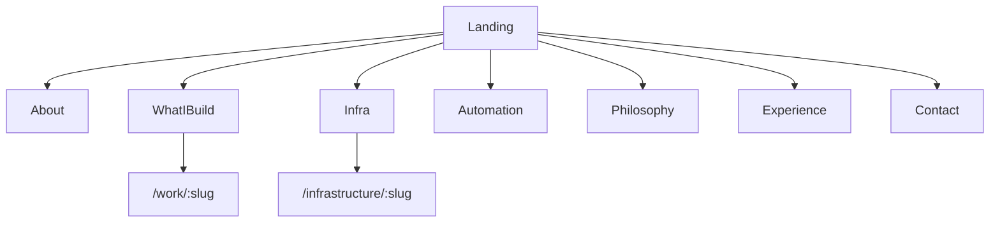

# Phase 1 Portfolio Updates

Rework the current Vite/React portfolio to match [docs/prompts/Phase1.txt](docs/prompts/Phase1.txt), using [docs/resume/20260707-050625_Final_Blueprint_Resume_v3.tex](docs/resume/20260707-050625_Final_Blueprint_Resume_v3.tex) as the only factual source. [docs/resume/portfolio-context.md](docs/resume/portfolio-context.md) is incomplete stubs - do not invent missing narratives; mark gaps as `TODO` in content modules.

## Scope of change

This is primarily an **IA + content + page rewrite** on the existing scaffold (Tailwind/shadcn/Framer Motion stay). Design tokens and motion primitives remain.

## Information architecture

Replace current routes/nav (`Projects`, `Skills`, `Resume`, Mission Control Contact) with Phase 1:

| Route | Purpose |
|-------|---------|
| `/` | Landing: hero + short teasers into work/infra/automation |
| `/about` | Ownership-focused narrative (not biography dump) |
| `/work` | What I Build - software products |
| `/work/:slug` | Product deep dive |
| `/infrastructure` | Infrastructure & Operations initiatives |
| `/infrastructure/:slug` | Initiative deep dive |
| `/automation` | Dedicated automation section |
| `/philosophy` | Engineering philosophy pillars |
| `/experience` | Timeline from resume |
| `/contact` | Simple professional contact |
| `/404` | Keep |

**Remove as primary pages:** `/skills`, `/resume`, `/projects` (and old `/projects/:slug`). Add redirects from old paths to new equivalents where useful (`/projects` → `/work`, `/resume` → `/contact` or resume PDF).

Update [src/components/layout/navItems.ts](src/components/layout/navItems.ts), [src/app/router.tsx](src/app/router.tsx), footer links, and terminal command targets (`projects` → `work`, drop `skills`).

**Keep:** boot sequence, subtle motion, command terminal, Konami badge (Phase 1 does not forbid them; Contact itself becomes ungimmicky).

## Content model rewrite

Replace the single mixed `projects.ts` catalog with three typed modules under `src/content/`:

1. **`products.ts` (What I Build)** - fields: mission, problem, solution, technology, role, outcome  
   - **Navdrishti** - from resume (Primary Technical Owner; React/TS/Supabase/PostgreSQL/Docker/GitHub Actions/Azure)  
   - **BrainPulses** - from resume (Production Platform Maintainer; React/JS/MongoDB/Azure Storage/n8n)  
   - **IT Ticket Automation** - listed in Phase 1 but **not named in resume** → card shell with clear `TODO` copy (no fabricated problem/outcome)

2. **`initiatives.ts` (Infrastructure & Operations)** - fields: objective, role, technologies, outcome  
   - Resume-backed: Microsoft 365 Tenant Migration (50+ users), Azure Infrastructure (~50% cost reduction), Self-Hosted Supabase, Docker/self-hosted production patterns, Linux/VPS administration  
   - Phase 1-listed but thin/missing in resume: TrueNAS / Secure Remote NAS, Sophos VPN → include structure with `TODO` detail, no invented outcomes

3. **`automation.ts`** - n8n self-hosted platform (SQLite→PostgreSQL), Microsoft/enterprise SaaS operational automation (truthful to resume), operational improvements; SharePoint / “future workflow platform” as `TODO` if not evidenced

4. **`profile.ts`** - real contact from resume:
   - Email `rushakgp06@gmail.com`
   - LinkedIn `https://www.linkedin.com/in/rushak-pachpande/`
   - GitHub `https://github.com/RushakPachpande`
   - Role framing: Platform Engineer / Platform & Solutions Engineer per resume
   - Subtitle: *I design, build, automate and operate digital platforms that solve real business problems.*
   - **Delete invented overview counters** (`deployments: 20`, `automationWorkflows: 12`, etc.)

5. **`timeline.ts`** - only resume facts:
   - NextGenInnov8, Pune - Apr 2025-Present - Platform & Technology Professional (+ real bullets as highlights)
   - MCA 2023-2025, ASM's IBMR (CGPA 7.57)
   - BBA (CA) 2019-2022, ASM's CSIT (CGPA 7.58)
   - Achievements only when stated (Navdrishti ownership, Azure ~50%, M365 50+ users, CI/CD, self-hosted Supabase/n8n)

6. **`philosophy.ts`** - align titles to Phase 1 list (Ownership; Build for maintainability; Automation over repetition; Documentation matters; Infrastructure is part of software; Solve business problems first; Simple systems outperform complicated ones)

## UI / feature changes

- **Landing** ([`HeroSection`](src/features/hero/HeroSection.tsx)): keep headline; update subtitle; CTAs Explore → `/work`, Download → `/resume.pdf`; remove System Overview metric dashboard (or replace with a non-numeric “focus areas” strip using only truthful labels). Teaser rows linking to Work / Infrastructure / Automation.
- **About**: rewrite from resume summary + Phase 1 prompts (who / how I think / what I enjoy / approach). No fake stats.
- **What I Build**: new feature component (reuse card lift patterns from [`FeaturedSystems`](src/features/systems/FeaturedSystems.tsx)); detail page mirrors Phase 1 fields.
- **Infrastructure & Operations**: timeline-or-cards layout for initiatives (not “projects”).
- **Automation**: dedicated page/section - platforms and workflow themes, no fabricated workflow counts.
- **Contact**: strip Mission Control framing from [`ContactMissionControl`](src/features/contact/ContactMissionControl.tsx); simple email + LinkedIn + GitHub + Resume download; keep a minimal form → `mailto:` only.
- **Resume page**: remove from nav; download remains via hero/contact/`public/resume.pdf` (user replaces PDF when ready; do not invent resume content in-app).
- **Skills page / capability matrix**: remove from nav/router (Phase 1 omits it). Optionally leave file unused or delete to avoid drift.

## Truthfulness rules (enforced in content)

- Use only resume-backed numbers: **~50% Azure cost reduction**, **50+ users M365 migration**, education CGPAs, employment dates.
- No lorem ipsum; unfinished Phase 1 items get explicit `TODO: …` strings in content (visible in UI as muted “Details forthcoming” or similar), never invented stories.
- Expand wording only when it restates resume facts.

## Hardening

- Update SEO titles/descriptions per new routes ([`Seo`](src/components/layout/Seo.tsx) usages).
- Update [`public/sitemap.xml`](public/sitemap.xml) and terminal help text.
- Ensure redirects don’t 404 old bookmarks.
- `npm run build` must pass.

## Out of scope

Supabase/CMS, regenerating the LaTeX PDF, filling empty `portfolio-context.md` narratives beyond TODOs, redesigning the visual system from scratch.
