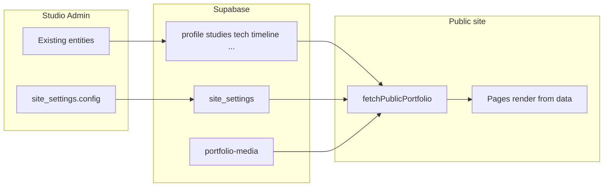

# Phased Full CMS + Platform Projects

## Current baseline

Studio already CMS-ed: profile, case studies (incl. **Featured** switch), technologies/logos, timeline, philosophy, resume/PDFs, media, inbox, terminal help catalog.

Still code-owned: hero/section chrome, Engineering Areas, footer, nav ([`src/components/layout/navItems.ts`](src/components/layout/navItems.ts)), category labels/paths ([`src/lib/portfolio.ts`](src/lib/portfolio.ts)), SEO strings, theme/favicon, terminal **behavior**, and category DB check (`platform|infrastructure|automation`).

Featured home slots already respect DB: `getFeaturedCaseStudies` + Studio switch on case study Basics tab. No new “featured system” needed-only seed projects and keep that toggle.

## Architecture decision (all phases)

Extend [`site_settings`](supabase/migrations/20260827194842_portfolio_schema.sql) with a single **`config jsonb not null default '{}'`** (new migration; do not edit old migrations). Keep `site_version` as today.

`config` shape (Zod-validated in app):

- `chrome` - hero, home sections, about/contact/category page copy, boot sequence, footer tagline/principles/stack
- `engineeringAreas` - cards (title, description, examples, href)
- `stats` - labels, descriptions, baseline year overrides
- `nav` - same structure as today’s `navStructure`
- `categories` - `{ id, label, path, seo, gridCopy }[]` (replaces hard-coded three)
- `brand` - favicon path, optional logo, CSS token overrides
- `seo` - site-wide defaults; pages merge overrides
- `featureFlags` - e.g. show terminal, show boot

Public fetch: expand [`fetchPublicPortfolio`](src/services/portfolio-public.ts) to return `siteConfig`. Admin: new `updateSiteConfig` + Studio pages. Seed: migrate current hardcoded strings into seed defaults in [`scripts/seed-portfolio.ts`](scripts/seed-portfolio.ts).

**Case study links** (needed for DISHA/LevelUP demos): add optional `links?: { label, url }[]` on [`CaseStudy`](src/types/portfolio.ts) + admin Basics fields + case study page render. No schema change (lives in `data` jsonb).

**Categories constraint:** Phase 3 migration replaces fixed `check (category in (...))` with validation against `site_settings.config.categories` (or drop check and validate in app/admin). Until then, new projects use `platform`.

---

## Phase 0 - Platform projects in DB (ship first, independent)

**Goal:** DISHA, LevelUP, and this portfolio appear as platform case studies; featured is toggled in Studio without code.

1. Copy logos into seed assets (svglogos.dev only for tech marks; project brands from source repos):
   - DISHA: ASM logo from `d:\Code\PGDM Induction Program\logo\`
   - LevelUP: `d:\Code\LevelUP\levelup-client\public\brand\zapienz-levelup.png`
   - Portfolio: existing site/favicon or a Studio mark under `src/assets/logos/`
2. Add seed case studies in [`src/content/caseStudies/platforms.ts`](src/content/caseStudies/platforms.ts) (and tech IDs as needed in [`technologies.ts`](src/content/technologies.ts)):
   - `disha` - multi-college PGDM induction; live student URL; featured default **on**
   - `levelup` - Zapienz school assessments; live student URL; featured default **on**
   - `personal-portfolio` - Studio CMS portfolio itself as major platform case study; featured default **on**
3. Full narrative fields matching existing Navdrishti/BrainPulses depth (stack, architecture nodes, decisions, challenges, outcome, learnings, `links` for demos).
4. Omit private GitHub URLs unless you later confirm public; use live demos:
   - DISHA: https://pgdminduction.nextgeninnov8.com
   - LevelUP: https://levelup.fureinc.com
5. Seed/upload logos via existing seed pipeline; run seed against local/prod when ready.
6. After seed: toggle Featured / Incomplete / sort order entirely in Studio.

**Deploy once** for seed content + `links` UI if Phase 0 ships with the links field; thereafter featured/content edits need no deploy.

---

## Phase 1 - Site Content CMS (chrome without structural change)

**Goal:** Change all marketing copy without deploy.

1. Migration: `config jsonb` on `site_settings`; backfill from current UI strings.
2. Types + Zod for `SiteConfig['chrome' | 'engineeringAreas' | 'stats']`.
3. Wire public UI to config (stop reading hardcoded JSX):
   - [`HeroSection.tsx`](src/features/hero/HeroSection.tsx) - use `profile.headline` + chrome eyebrow/CTA
   - Home sections, [`EngineeringAreas.tsx`](src/features/...), stats labels, About/Contact/category eyebrows, [`Footer.tsx`](src/components/layout/Footer.tsx), boot sequence
4. Studio: **Site → Content** page (grouped editors + preview).
5. Seed defaults so `db:seed` restores known-good chrome.

**After Phase 1 deploy:** logos, projects, tech, profile, and page chrome are CMS-only.

---

## Phase 2 - Structure CMS (nav + categories + areas CRUD)

**Goal:** Own IA without code.

1. Persist `nav` + `categories` in `config`; Navbar/Footer/terminal nav help read from portfolio data.
2. Migration: relax `case_studies.category` check; admin SelectField driven by `config.categories`.
3. Dynamic category routes: keep three known paths working; add generic `/work/:categoryPath` or generate routes from config (prefer generating from `categories[].path` with a single page component).
4. Engineering Areas become editable list (not fixed three cards).
5. Studio: **Site → Navigation** and **Site → Categories**.

**After Phase 2 deploy:** add/rename Work sections and nav labels without code (new *page templates* still need code).

---

## Phase 3 - Brand & SEO CMS

**Goal:** Visual identity + discovery without deploy.

1. `brand` + `seo` in config; favicon/logo via Media library paths.
2. Apply CSS variables from `brand.tokens` at runtime (document-safe subset: colors, not arbitrary CSS).
3. Per-page SEO from config + case study fields; generate/update sitemap from public case study slugs (build step or admin “Publish SEO” that writes `public/sitemap.xml` is optional-prefer runtime `Seo` component first).
4. Studio: **Site → Brand** and **Site → SEO**.

**After Phase 3 deploy:** rebrand colors/favicon/default meta without code.

---

## Phase 4 - Terminal & polish (optional depth)

**Goal:** Close remaining “needs deploy” gaps that are still content-like.

1. Move safe terminal outputs (welcome, about blurb, help text) into `terminal_commands.data` / config; keep dangerous/easter-egg **logic** in code.
2. Feature flags in config (hide incomplete sections, disable boot, etc.).
3. Admin docs in-app (“what needs a deploy vs Studio”).
4. Portfolio case study gallery screenshots of Studio itself (optional media pass).

---

## What still always needs a deploy

- New React page templates / interaction patterns
- Auth/security changes, dependency upgrades
- Terminal command *behavior* (not copy)
- Arbitrary theme engines beyond token map
- Schema migrations (run `db:push` / migration apply-not a Vite frontend deploy, but still ops)

---

## Rollout order (recommended)

| Order | Phase | Public value | Deploy? |
|------:|-------|--------------|---------|
| 1 | Phase 0 | DISHA, LevelUP, Portfolio as platforms; Featured toggles | Yes (seed + links) |
| 2 | Phase 1 | Full copy/chrome CMS | Yes |
| 3 | Phase 2 | Nav/categories CMS | Yes |
| 4 | Phase 3 | Brand/SEO CMS | Yes |
| 5 | Phase 4 | Terminal/flags polish | Yes |

Each phase is mergeable alone. Do not start Phase 2 until Phase 1’s `config` column and fetch path exist.

---

## Verification per phase

- `npx tsc -b`, admin save → public refresh shows change without rebuild
- Featured on/off for DISHA/LevelUP/Portfolio updates home grid (max 4 featured)
- `npm audit` clean after any dependency change
- New migration only via `npx supabase migration new …`
