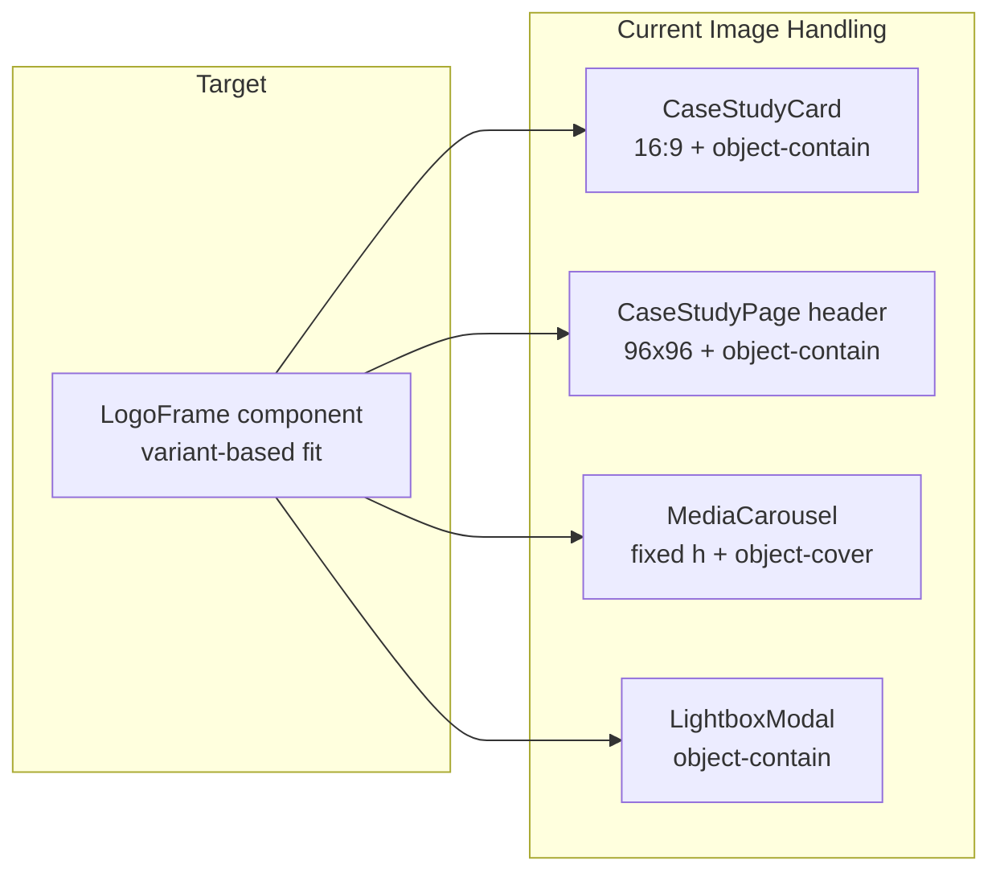

# Portfolio UX Polish: Images, Typography, Terminal, Mobile

## Problem Summary

Four separate issues share a common theme: **inconsistent sizing/fit rules** and **sub-12px text** that hurts readability on mobile.

| Area | Root cause |
|------|------------|
| Images/logos | Four inline `` patterns with conflicting `object-cover` vs `object-contain`; gallery crops logos |
| Typography | Custom `text-[10px]` / `text-[11px]` below Tailwind scale; mono labels hard to read |
| Terminal banner | `whitespace-pre-wrap` + `text-pretty` wraps fixed-width ASCII; em dash (`—`) breaks monospace cell alignment |
| Mobile | Grids have `min-w-0`, but outer sections/articles and some modals lack it; hero/headings may overflow at 320px |



---

## 1. Unified Image / Logo Display

### Create shared component

Add [`src/components/media/LogoFrame.tsx`](src/components/media/LogoFrame.tsx) — single source of truth for logo/media fit:

| Variant | Container | Image fit | Notes |
|---------|-----------|-----------|-------|
| `card` | `AspectRatio` 16/9, `bg-muted/30` | `object-contain`, `max-h-[85%] max-w-[85%]` | Reduce padding from `p-6` to `p-3 sm:p-4` so logos fill more of the frame |
| `header` | `size-28 sm:size-32` rounded box | `object-contain` | Slightly larger than current `size-24` |
| `gallery` | `AspectRatio` 16/9 | `object-contain` centered | Replaces fixed `h-72 object-cover` |
| `lightbox` | flex center, `max-h-[75vh]` | `object-contain` with inner padding | Consistent with gallery |

Props: `src`, `alt`, `variant`, optional `className`, `loading`.

### Wire up consumers

- [`src/features/case-studies/CaseStudyCard.tsx`](src/features/case-studies/CaseStudyCard.tsx) — replace inline `AspectRatio` + `` block
- [`src/features/case-studies/CaseStudyPage.tsx`](src/features/case-studies/CaseStudyPage.tsx) — header logo uses `variant="header"`
- [`src/components/media/MediaCarousel.tsx`](src/components/media/MediaCarousel.tsx) — wrap image in `LogoFrame variant="gallery"`; remove `object-cover` and fixed heights
- [`src/components/media/LightboxModal.tsx`](src/components/media/LightboxModal.tsx) — use `LogoFrame variant="lightbox"`

**Key fix:** Gallery currently uses `object-cover` which crops logos; switching to `object-contain` inside a ratio box matches card/header behavior.

---

## 2. Typography: Nerd Font + Readable Sizes

### Add JetBrains Mono Nerd Font

Fontsource does not ship Nerd Font patches. Self-host a subset:

1. Add woff2 files under [`src/assets/fonts/jetbrains-mono-nerd/`](src/assets/fonts/jetbrains-mono-nerd/) (Regular 400, Medium 500 — download from [Nerd Fonts releases](https://github.com/ryanoasis/nerd-fonts/releases), JetBrainsMono subset)
2. Register `@font-face` in [`src/index.css`](src/index.css)
3. Update token:

```css
--font-mono: "JetBrainsMono Nerd Font", "JetBrains Mono", ui-monospace, monospace;
```

Keep Inter (body) and Space Grotesk (display) unchanged — Nerd Font applies only to `--font-mono` (terminal, badges, eyebrows, meta labels).

Also update [`404.html`](404.html) Google Fonts fallback to note mono stack (optional CDN fallback to JetBrains Mono if nerd files unavailable).

### Minimum readable size pass

Establish a project rule: **no text below `text-xs` (12px)**.

| Current | Target | Files |
|---------|--------|-------|
| `text-[10px]` | `text-xs` | `CaseStudyCard`, `CaseStudyPage`, `TechnologyLibraryGrid` |
| `text-[11px]` | `text-xs sm:text-sm` | `Footer`, `Navbar`, `CommandTerminal`, `AppShell`, `ResumePreview`, `EngineeringAreas`, `ExperienceTimeline`, `TechBadge` tooltip |
| Eyebrow labels (`text-xs` mono uppercase) | `text-xs sm:text-sm` | `HeroSection`, `Reveal`, `HomeSections`, `BootSequence`, etc. |
| Terminal output area | `text-sm sm:text-base` | `CommandTerminal` scroll region |

Optional base-layer tweak in [`src/index.css`](src/index.css):

```css
@media (max-width: 639px) {
  body { font-size: 16px; } /* explicit, prevents accidental shrink */
}
```

Bump [`LightboxModal`](src/components/media/LightboxModal.tsx) type label from `text-xs` to `text-sm`.

---

## 3. Command Terminal Banner Fix

### Root cause (confirmed in [`src/content/terminal.ts`](src/content/terminal.ts) + [`CommandTerminal.tsx`](src/components/terminal/CommandTerminal.tsx))

- Banner uses Unicode box-drawing (`╔═╗`) + em dash (`—`)
- Rendered with `whitespace-pre-wrap text-pretty` — wraps on narrow modal, breaking right border alignment

### Fixes

**A. Simpler ASCII banner** in [`src/content/terminal.ts`](src/content/terminal.ts):

Replace heavy box chars with plain ASCII and hyphen (equal cell width):

```
+------------------------------------------+
|  rushak@platform - portfolio terminal    |
+------------------------------------------+
```

Inner width ~42 chars — fits mobile modal without wrapping.

**B. Conditional pre styling** in [`CommandTerminal.tsx`](src/components/terminal/CommandTerminal.tsx):

- System/banner lines: `whitespace-pre overflow-x-auto text-sm leading-relaxed` (no `text-pretty`, no wrap)
- Command output lines: keep `whitespace-pre-wrap` for long prose
- Add `overflow-x-auto` on scroll container for `help`/`nav` tabular output

**C. Mobile header hint** — hide secondary hint on xs, show abbreviated version:

```tsx
<span className="hidden sm:inline">v{SITE_VERSION} · Ctrl+K close · ↑↓ history · Tab complete</span>
<span className="sm:hidden font-mono text-xs text-muted-foreground">Ctrl+K close</span>
```

---

## 4. Mobile Responsiveness Audit

The project already uses mobile-first Tailwind and [`responsiveCardGridClassName`](src/lib/utils.ts) with `[&>*]:min-w-0`. Remaining work is a targeted pass, not a rewrite.

### Structural hardening

Add `min-w-0` to outer wrappers missing it:

- [`CaseStudyPage.tsx`](src/features/case-studies/CaseStudyPage.tsx) — `<article>`
- [`AboutPage.tsx`](src/pages/AboutPage.tsx), [`PhilosophyGrid.tsx`](src/features/philosophy/PhilosophyGrid.tsx), [`TechnologyLibraryGrid.tsx`](src/features/technology-library/TechnologyLibraryGrid.tsx) — section roots
- [`ContactPanel.tsx`](src/features/contact/ContactPanel.tsx) — section + `lg:grid` wrapper

### Typography overflow

- [`HeroSection.tsx`](src/features/hero/HeroSection.tsx) — `text-5xl` → `text-4xl sm:text-5xl md:text-7xl` to prevent horizontal clip at 320px
- [`CaseStudyPage.tsx`](src/features/case-studies/CaseStudyPage.tsx) — `text-4xl sm:text-5xl` → `text-3xl sm:text-4xl md:text-5xl`
- Ensure long badge rows use `flex-wrap` (already present on cards)

### Modals / overlays

- **Terminal:** banner fix + `max-h-[85vh]` on xs; bottom-sheet layout already correct (`items-end sm:items-center`)
- **Lightbox:** add `max-h-[90vh] overflow-y-auto` wrapper; image uses `LogoFrame`
- **Nav sheet:** verify terminal button visible (already in sheet footer)

### Component-specific checks

| Component | Action |
|-----------|--------|
| `ArchitectureFlow` | Add `min-w-0` on grid; verify node labels wrap with `break-words` |
| `ExperienceTimeline` | Confirm timeline line doesn't cause overflow on 375px |
| `ResumePreview` | Verify `xl:grid` sidebar collapses cleanly; contact line readable after font bump |
| `MediaCarousel` | Nav buttons don't overlap caption on narrow screens (reduce button size or stack caption below on xs) |
| `TechBanner` | Already `flex-wrap min-w-0` — verify after font size increase |

### Verification checklist (manual, before push)

Test at **320px, 375px, 768px, 1024px** on:

- `/` Home (hero, featured cards, engineering areas)
- `/platforms`, `/infrastructure`, `/automation` (grids)
- `/platforms/:slug` (detail header, gallery, lightbox, TOC hidden on mobile)
- `/resume`, `/contact`, `/about`, `/philosophy`
- Terminal (Ctrl+K / nav sheet button), lightbox expand
- Confirm no horizontal scroll on any page (`overflow-x-clip` stays effective)

Run `npm run build` to ensure no TS/lint regressions.

---

## Files Changed (expected)

| File | Change |
|------|--------|
| `src/components/media/LogoFrame.tsx` | **New** shared image component |
| `src/features/case-studies/CaseStudyCard.tsx` | Use LogoFrame; badge sizes |
| `src/features/case-studies/CaseStudyPage.tsx` | LogoFrame header; badge sizes; min-w-0; heading scale |
| `src/components/media/MediaCarousel.tsx` | LogoFrame gallery variant |
| `src/components/media/LightboxModal.tsx` | LogoFrame lightbox variant |
| `src/content/terminal.ts` | ASCII banner rewrite |
| `src/components/terminal/CommandTerminal.tsx` | Pre styling split; mobile hint; font size |
| `src/index.css` | Nerd Font @font-face; optional mobile base size |
| `src/assets/fonts/jetbrains-mono-nerd/*` | **New** font files |
| ~10 other files | `text-[10px]`/`text-[11px]` → readable sizes |
| `src/features/hero/HeroSection.tsx` | Responsive heading scale |
| `src/features/contact/ContactPanel.tsx` | min-w-0 |
| `404.html` | Mono fallback alignment (minor) |

No content/data changes to case studies unless real screenshot assets are added later.

---

## Out of Scope (noted for future)

- Replacing gallery logo placeholders with actual screenshots/diagrams (content task)
- Wiring unused `coverImage` when it differs from `logo` (currently dead field)
- Adding real screenshot assets to `src/assets/`
