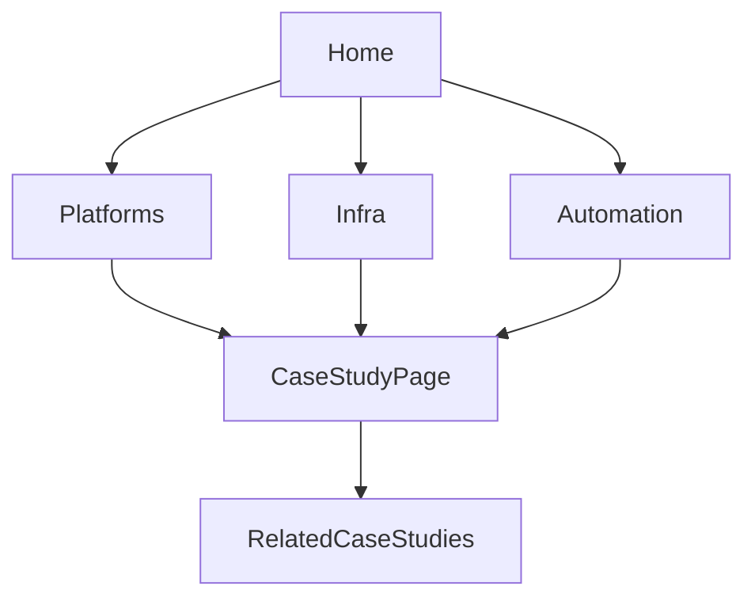

# Portfolio V2 — Engineering Case Study Updates

Implement [docs/prompts/Portfolio_V2_Engineering_Case_Study_PRD.md](docs/prompts/Portfolio_V2_Engineering_Case_Study_PRD.md) on the existing Vite/React site. Keep the current visual language (dark Mission Control, Framer Motion, shadcn). Optimize for engineering storytelling, not new gimmicks.

**Default scope call:** Ship the unified case-study system, IA, homepage, and expanded resume-backed narratives. Embed architecture narrative + optional simple diagrams inside each case study. Do **not** build separate Architecture/Deployment Gallery pages or invent screenshots/metrics; optional `media[]` / `futureImprovements[]` fields can stay empty until assets exist.

## Information architecture

| Route | Change |
|-------|--------|
| `/` | Homepage rewrite (see below) |
| `/about` | Keep; tighten to short ownership narrative |
| `/platforms` | Rename from `/work` (What I Built → Platforms) |
| `/platforms/:slug` | Case study detail |
| `/infrastructure` | Keep list |
| `/infrastructure/:slug` | Same case study template |
| `/automation` | Case study cards (not summary-only cards) |
| `/automation/:slug` | **New** detail routes |
| `/experience` | Keep timeline; feed homepage snapshot |
| `/philosophy` | Align pillar set to V2 |
| `/resume` | **Restore** preview + download page |
| `/contact` | Keep simple contact |
| Redirects | `/work` → `/platforms`, `/work/:slug` → `/platforms/:slug`, keep `/projects` → `/platforms` |

Update [src/components/layout/navItems.ts](src/components/layout/navItems.ts), [src/app/router.tsx](src/app/router.tsx), footer, terminal commands, sitemap.



## Unified content model

Replace separate shallow shapes with one typed case study in [src/content/caseStudies.ts](src/content/caseStudies.ts) (or `src/content/case-studies/` split by category if file size grows):

```ts
type CaseStudyCategory = 'platform' | 'infrastructure' | 'automation'

type CaseStudy = {
  slug: string
  category: CaseStudyCategory
  name: string
  summary: string          // one-line card summary
  status: string
  logo?: string
  logoAlt?: string
  technologies: string[]   // flat tags for cards
  stack: { group: string; items: string[] }[]  // grouped stack
  businessContext: string
  problem: string
  objective: string
  solution: string
  architecture: string     // prose; optional diagram id later
  responsibilities: string[]
  decisions: { decision: string; rationale: string }[]
  challenges: { challenge: string; resolution: string }[]
  outcome: string
  learnings: string[]
  relatedSlugs: string[]
  incomplete?: boolean
  todoNote?: string
}
```

**Migrate & place items:**

- **Platform:** Navdrishti, BrainPulses (from [products.ts](src/content/products.ts)). Remove IT Ticket Automation from platforms — it already lives in automation with real copy.
- **Infrastructure:** existing initiatives (M365, Azure, Supabase, Docker, Linux, TrueNAS, Sophos) mapped into full template; expand from resume; keep `incomplete` only where narrative still thin.
- **Automation:** self-hosted n8n, M365/SharePoint workflows, IT Support Ticket Automation, Microsoft integrations / operational improvements as case studies. No “future workflow” ideas.

Helpers: `getCaseStudy(slug)`, `getCaseStudiesByCategory()`, `getRelatedCaseStudies()`. Deprecate or thin-wrapper-delete old `products.ts` / `initiatives.ts` / `automation.ts` after migration.

**Truthfulness:** Expand only from [docs/resume](docs/resume/) + existing verified content. Never invent metrics. Use explicit `TODO` / incomplete flags when a section cannot be honestly filled.

## Shared UI

1. **`CaseStudyCard`** — title, one-line summary, tech tags, status, CTA “View Engineering Case Study”. Replaces product/initiative card chrome in list pages and homepage featured strip.
2. **`CaseStudyPage`** — single detail layout used by all three categories:
   - Hero: name, category, status, technologies, logo
   - Sticky in-page TOC (desktop) + smooth scroll to sections
   - Sections in PRD order: Business Context → Problem → Objective → Solution → Architecture → Responsibilities → Engineering Decisions → Challenges → Technology Stack → Outcome → Key Learnings
   - Footer: Related Case Studies; download resume link where relevant
3. **Engineering Areas** block — three pillar cards (Platform / Infrastructure / Automation) linking to category routes; replaces generic “skills” framing on Home ([HomeTeasers](src/features/home/HomeTeasers.tsx) evolves into this).

Keep design tokens, `Reveal`, magnetic buttons, boot/terminal.

## Homepage ([HomePage.tsx](src/pages/HomePage.tsx))

Concise sequence only:

1. Hero (existing headline/CTAs; Explore → `/platforms`)
2. Short About (2–3 sentences from profile)
3. Engineering Areas (3 pillars)
4. Featured Case Studies (hand-picked complete studies via `featured: true` or explicit slug list — e.g. Navdrishti, BrainPulses, M365, n8n)
5. Experience Snapshot (2–3 timeline highlights, link to `/experience`)
6. Contact CTA

Remove stacking full ProductGrid + InitiativeGrid on Home.

## Philosophy & Resume

- Update [philosophy.ts](src/content/philosophy.ts) pillars to V2 set: Ownership, Documentation, Automation, Scalability, Maintainability, Simplicity, Continuous Learning, Business Impact (rewrite copy to avoid clichés; keep truthful tone).
- Restore `/resume` page (preview + `/resume.pdf` download) and nav item; keep contact resume CTA.

## Terminal / SEO

- Commands: `platforms` (alias `work`/`projects`), `infrastructure`, `automation`, `resume` → page, drop obsolete skills wording.
- SEO titles/descriptions and [public/sitemap.xml](public/sitemap.xml) for new routes.

## Implementation order

1. Case study type + migrate content (platforms/infra/automation) with expanded sections from resume.
2. Build `CaseStudyCard` + `CaseStudyPage` (sticky TOC); wire detail routes including `/automation/:slug`.
3. Rename Platforms, update nav/redirects/lists; restore Resume.
4. Homepage + Engineering Areas + Experience Snapshot.
5. Philosophy update; terminal/SEO/sitemap; delete dead modules/pages; `npm run build`.

## Out of scope (this V2 pass)

Separate Architecture Gallery / Deployment Gallery destinations, CMS/Supabase, inventing diagrams/screenshots, regenerating LaTeX resume PDF.
