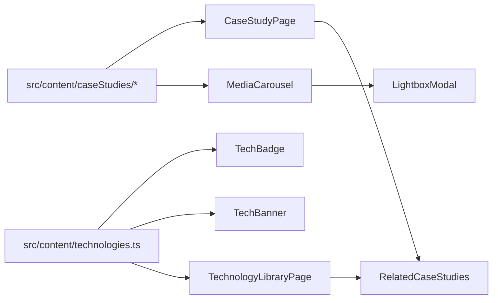

# Portfolio V3 - Premium Engineering Experience

Implement [docs/prompts/v3.md](docs/prompts/v3.md) as an evolution of the current case-study architecture (not a redesign). Use approved local/official branding assets and build full gallery infrastructure, populating it where media exists now.

## Scope decisions locked

- **Technology branding source:** use current local assets plus approved official SVGs.
- **Gallery scope:** implement full reusable gallery + lightbox system and attach media only where assets exist.

## Current baseline to extend

- Routing + V2 case-study model already in place: [src/app/router.tsx](src/app/router.tsx), [src/content/caseStudies/types.ts](src/content/caseStudies/types.ts).
- Shared case-study view exists with sticky TOC: [src/features/case-studies/CaseStudyPage.tsx](src/features/case-studies/CaseStudyPage.tsx).
- Available media currently includes 7 image assets under [assets/images](assets/images).

## V3 implementation plan

### 1) Technology branding system

Create a centralized technology catalog to power consistent logos, labels, descriptions, and cross-links.

- Add `src/content/technologies.ts` with:
  - `Technology` type: `id`, `name`, `category`, `logo`, `description`, `usedInSlugs`.
  - category groups matching V3 prompt (frontend/backend/database/cloud/infrastructure/automation/version-control).
- Add `src/assets/tech/` for normalized logo files (SVG preferred, fallback png/webp if needed).
- Extend case-study content shape in [src/content/caseStudies/types.ts](src/content/caseStudies/types.ts):
  - Keep existing `technologies: string[]` for backward compatibility.
  - Add `technologyIds: string[]` (canonical mapping to library).
  - Add `difficulty`, `timeline`, `coverImage?`, `gallery?`, `architectureNodes?`.

### 2) Premium tech badges + technology banner

Replace plain text pills with logo-first badges and add an interactive banner at case-study top.

- New reusable components:
  - `src/components/tech/TechBadge.tsx` (logo + name card style)
  - `src/components/tech/TechBanner.tsx` (horizontal scroll row with hover animation + tooltip)
- Wire into:
  - [src/features/case-studies/CaseStudyCard.tsx](src/features/case-studies/CaseStudyCard.tsx)
  - [src/features/case-studies/CaseStudyPage.tsx](src/features/case-studies/CaseStudyPage.tsx)
- Tooltip content comes from technology library description, not hardcoded text.

### 3) Interactive architecture visuals

Add a structured architecture section per case study (card nodes + connection lines), with hover highlighting.

- New component `src/features/case-studies/ArchitectureFlow.tsx`:
  - consumes `architectureNodes` data from case study
  - renders connected nodes (Frontend → Backend/Data → Cloud → Enterprise/Automation)
  - subtle hover emphasis and active-edge styling
- Embed below “Architecture” prose in [src/features/case-studies/CaseStudyPage.tsx](src/features/case-studies/CaseStudyPage.tsx).

### 4) Rich statistics + timeline polish

Upgrade numbers into meaningful engineering metrics and improve timeline storytelling.

- Add `engineeringStats` data in `src/content/profile.ts` or new `src/content/stats.ts`:
  - Production Systems
  - Automation Workflows
  - Infrastructure Projects
  - Platforms Delivered
  - Enterprise Technologies
  - Years Learning
- New `src/features/home/EngineeringStats.tsx` with animated counters + context labels.
- Integrate on home below Engineering Areas.
- Enhance [src/features/timeline/ExperienceTimeline.tsx](src/features/timeline/ExperienceTimeline.tsx):
  - add connected initiative points (Navdrishti, BrainPulses, Azure, M365, TrueNAS, Docker, n8n)
  - keep existing chronology accurate and non-fabricated.

### 5) Rich cards and visual hierarchy upgrades

Enrich case-study cards without clutter.

- Update [src/features/case-studies/CaseStudyCard.tsx](src/features/case-studies/CaseStudyCard.tsx) to include:
  - cover image/illustration
  - technology banner preview (first few badges)
  - difficulty badge
  - category + status
  - timeline label
  - CTA unchanged: “View Engineering Case Study”
- Add section dividers and stronger heading rhythm in:
  - [src/pages/HomePage.tsx](src/pages/HomePage.tsx)
  - [src/features/case-studies/CaseStudyPage.tsx](src/features/case-studies/CaseStudyPage.tsx)

### 6) Gallery + lightbox infrastructure

Implement reusable media galleries across case studies.

- New shared components:
  - `src/components/media/MediaCarousel.tsx`
  - `src/components/media/LightboxModal.tsx`
- Extend case-study data with `gallery: {src, caption, type}[]`.
- Populate from existing assets now for Navdrishti/BrainPulses/n8n-related studies, leave empty arrays where unavailable.
- Render section in case studies:
  - “Engineering Gallery” with screenshots, diagrams, workflow images, infra/deployment visuals.

### 7) Cross references + technology library page

Add dedicated technology library route and richer graph of relationships.

- New page: `src/pages/TechnologyLibraryPage.tsx` route `/technology-library`.
- New feature: `src/features/technology-library/TechnologyLibraryGrid.tsx`.
- Each technology card shows:
  - official logo, name, category
  - where used (`usedInSlugs`)
  - related case studies links
  - short experience summary
- Add “Used in” and “Related case studies” blocks inside each case study using the same mapping.

### 8) Footer upgrade

Enhance [src/components/layout/Footer.tsx](src/components/layout/Footer.tsx) with:

- engineering principles summary
- current focus
- links (GitHub, LinkedIn, Resume, Contact)
- portfolio build stack
- version + last updated timestamp

## Route updates

Update [src/app/router.tsx](src/app/router.tsx) and nav:

- add `/technology-library`
- keep existing V2 routes unchanged
- include nav link label “Technology Library” (or “Technologies” if space constrained)

## Data flow diagram

## Files to touch first

- [src/content/caseStudies/types.ts](src/content/caseStudies/types.ts)
- [src/content/caseStudies/platforms.ts](src/content/caseStudies/platforms.ts)
- [src/content/caseStudies/infrastructure.ts](src/content/caseStudies/infrastructure.ts)
- [src/content/caseStudies/automation.ts](src/content/caseStudies/automation.ts)
- [src/features/case-studies/CaseStudyCard.tsx](src/features/case-studies/CaseStudyCard.tsx)
- [src/features/case-studies/CaseStudyPage.tsx](src/features/case-studies/CaseStudyPage.tsx)
- [src/pages/HomePage.tsx](src/pages/HomePage.tsx)
- [src/app/router.tsx](src/app/router.tsx)

## Verification

- `npm run build` must pass.
- Check key routes:
  - `/platforms`, `/infrastructure`, `/automation`
  - `/platforms/navdrishti`, `/automation/it-support-ticket-automation`
  - `/technology-library`
- Confirm no broken logo/media links and no invented metrics introduced.
