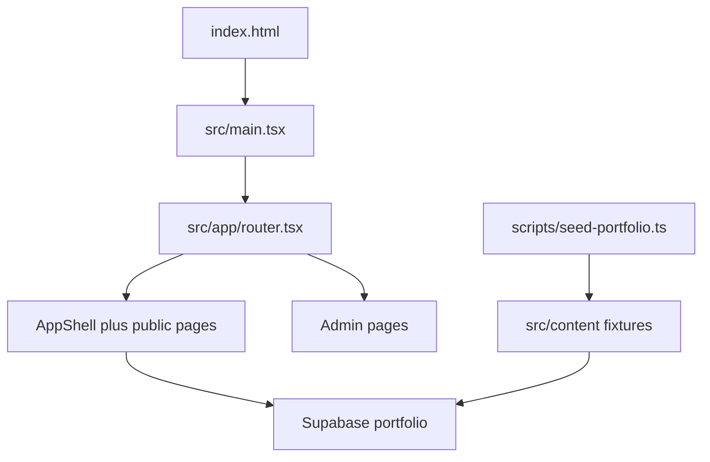

# Repo dead-code cleanup

The app already follows a standard Vite + React layout: [`src/app`](src/app) (router and shell), [`src/pages`](src/pages) (routes), [`src/features`](src/features), [`src/components`](src/components), [`src/hooks`](src/hooks), [`src/lib`](src/lib), [`src/services`](src/services), and [`src/content`](src/content) (runtime defaults plus seed fixtures). Every file under `src/pages` is on a live route. Seed content (`profile`, `timeline`, `philosophy`, `resume`, `technologies`, `caseStudies`) is required by `npm run db:seed` even though the browser loads portfolio data from Supabase. Those stay.

No folder moves. Relocating seed modules would rewrite the asset loader and seed imports without changing how the site runs.

## Delete (no importers)

- [`src/components/ui/card.tsx`](src/components/ui/card.tsx) and [`src/components/ui/dropdown-menu.tsx`](src/components/ui/dropdown-menu.tsx) — shadcn files with no imports. Navbar uses a CSS class named `nav-dropdown-menu`, not this component. Other `src/components/ui/*` files stay.
- [`src/services/portfolio.ts`](src/services/portfolio.ts) — unused re-export barrel. Callers already import [`portfolio-public.ts`](src/services/portfolio-public.ts) and [`portfolio-admin.ts`](src/services/portfolio-admin.ts).
- [`src/content/index.ts`](src/content/index.ts) and [`src/content/stats.ts`](src/content/stats.ts) — barrel and static stats only referenced by that barrel. Live stats come from [`src/lib/portfolio.ts`](src/lib/portfolio.ts).
- [`src/features/admin/preview/index.ts`](src/features/admin/preview/index.ts) — unused barrel. Preview screens import their modules directly.
- [`scripts/_cleanup-n8n-webp.ts`](scripts/_cleanup-n8n-webp.ts) and [`scripts/_verify-case-logos.ts`](scripts/_verify-case-logos.ts) — one-off maintenance scripts, not in [`package.json`](package.json).
- [`public/icons.svg`](public/icons.svg) — Vite scaffold sprite. [`index.html`](index.html) only uses `/favicon.svg`.

## Trim dead code inside live files

- Remove `CategoryIdCaseStudyPage` from [`src/pages/SiteConfigPathResolver.tsx`](src/pages/SiteConfigPathResolver.tsx). `SiteConfigPathResolver` stays; it is the catch-all route. Drop imports that only the unused helper needs (`useParams`, `getCategoryMeta`).
- Remove `ParallaxLayer` from [`src/components/effects/Parallax.tsx`](src/components/effects/Parallax.tsx). `ScrollFadeIn` stays; it is used by the home page.

## Leave in place

- All routed pages, features, hooks, lib helpers, and admin preview modules.
- Seed pipeline: [`scripts/seed-portfolio.ts`](scripts/seed-portfolio.ts), [`scripts/dedupe-portfolio-media.ts`](scripts/dedupe-portfolio-media.ts), [`scripts/copy-spa-fallback.mjs`](scripts/copy-spa-fallback.mjs), asset loaders, and [`src/content`](src/content) fixtures those scripts import.
- [`supabase/migrations`](supabase/migrations), [`package-lock.json`](package-lock.json), [`.env.example`](.env.example).
- Gitignored local tooling and notes (`.cursor/`, `.agents/`, `docs/`, `GITHUB_README.md`). They are not part of the running app and are not in git.

## Check after edits

Re-scan imports, then run `npx tsc -b` and `npm run lint`. These deletions do not change routes or UI, so a typecheck and lint pass is the verification. Do not start a second dev server.