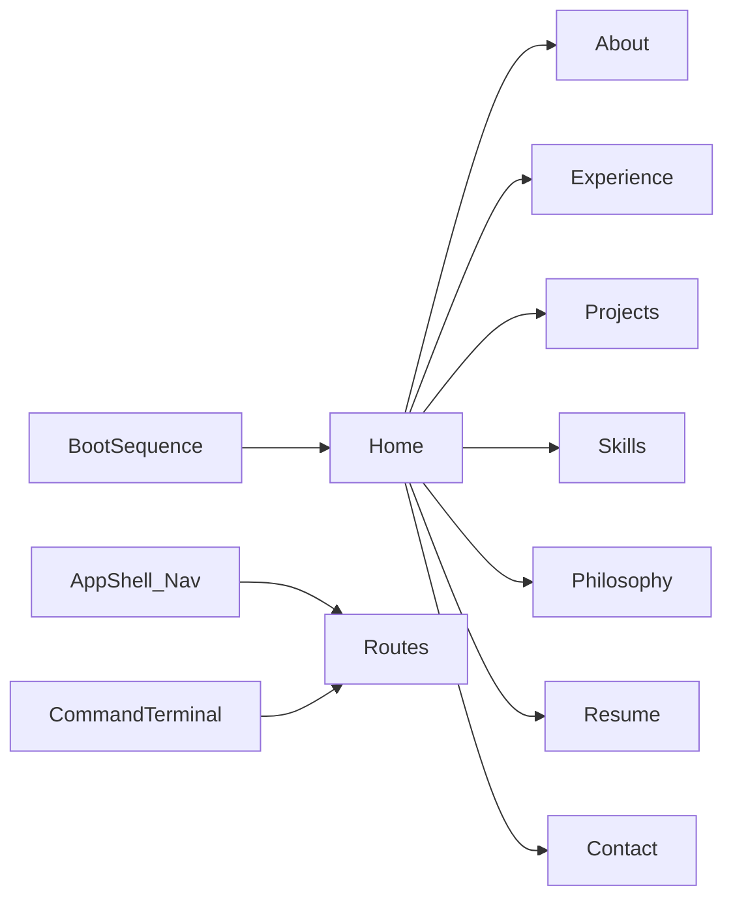

# Rushak Pachpande Portfolio

Build a production-quality portfolio from [Master Prompt.txt](Master%20Prompt.txt) in the empty workspace. [Prompt.txt](Prompt.txt) is treated as a shorter secondary brief; Master Prompt wins on pages, stack, and features.

## Product intent

Within 10 seconds, the site must read as **platform ownership** (infra, automation, Azure, M365, production deploy)—not “another React developer.” Aesthetic: dark premium Mission Control (Linear/Vercel/Stripe-adjacent), intentional motion, no cyberpunk/neon overload.

**Design note:** Follow the Master Prompt palette/fonts/cards/glow even where they conflict with generic frontend heuristics—the brief is the design system.

## Stack and scaffolding

- **Vite + React 19 + TypeScript + Tailwind CSS v4**
- **React Router** (multi-page SPA)
- **Framer Motion**, **Lucide**, **shadcn/ui** (via project `components.json`)
- **ESLint** + path aliases (`@/`)
- Init git after scaffold (repo currently absent)

Default content strategy: typed modules under `src/content/` with solid copy derived from the Master Prompt (roles, project names, capability categories). Contact uses a Mission Control form UI that currently submits via `mailto:` / opens social links; wire shape ready for a future Supabase edge function. Resume download points at `/resume.pdf` (placeholder asset until a real PDF is added).

## Information architecture



| Route | Purpose |
|-------|---------|
| `/` | Boot → Hero, System Overview, Featured Systems teaser, CTAs |
| `/about` | Expanded system/profile narrative |
| `/experience` | Interactive vertical timeline |
| `/projects` | Full systems catalog |
| `/projects/:slug` | Deep dive: Mission, Problem, Architecture, Role, Tech, Challenges, Impact, Status |
| `/skills` | Capability matrix (no skill bars) |
| `/philosophy` | Ownership, docs, automation, scalability, simplicity, business-first, learning |
| `/resume` | Preview + download |
| `/contact` | Mission Control panel |
| `*` | Branded 404 |

## Folder structure

```
src/
  app/           # router, providers, boot gate
  components/
    layout/      # AppShell, Navbar, Footer, PageTransition
    ui/          # shadcn primitives
    effects/     # grid bg, gradient blobs, cursor glow
    terminal/    # InteractiveCommandTerminal
    shared/      # MagneticButton, SectionHeader, AnimatedCounter, Reveal
  features/      # hero, overview, systems, philosophy, skills, timeline, resume, contact
  content/       # typed data: profile, projects, skills, timeline, philosophy, terminal
  hooks/         # usePrefersReducedMotion, useKonami, useMagnetic, etc.
  lib/           # cn, motion variants, seo helpers
  styles/        # globals + CSS variables
```

Content stays data-driven so later Supabase/CMS can swap the same component props without redesign.

## Visual system

CSS variables on `#050816` base:

- Card: `#111827`
- Accents: electric blue, deep purple, soft cyan (subtle, not rainbow)
- Fonts: **Space Grotesk** (display), **Inter** (body), **JetBrains Mono** (terminal/meta)
- Soft borders, light glass, refined shadows, generous whitespace
- Animated grid + floating gradient blobs (low opacity, paused under `prefers-reduced-motion`)

## Key UX features

1. **Boot sequence** (once per session via `sessionStorage`): Initializing Platform → Infrastructure → Projects → Services → System Ready → fade into Hero.
2. **Hero**: name, role stack, headline *Building Systems, Not Just Software.*, supporting line from brief, CTAs Explore / Download Resume; alive but quiet background.
3. **System Overview** (dashboard metaphor): Experience, Projects, Deployments, Cloud Platforms, Automation Workflows, Location, Current Mission, Current Status—with animated counters.
4. **Featured Systems** cards (not generic “Projects”): Navdrishti, BrainPulses, Office365 Migration, Azure Infrastructure, IT Ticket Automation, Docker Deployment, TrueNAS Migration, Sophos VPN—each field-complete in content types.
5. **Capability Matrix**, **Philosophy**, **Timeline**, **Resume preview**, **Contact Mission Control**.
6. **Interactive terminal** (help, about, projects, skills, resume, contact, clear, whoami, deploy, coffee, `sudo hire rushak`)—professional tone, can navigate routes.
7. **Easter eggs** (sparse): Konami → Developer mode / achievement badge; version string in footer; terminal jokes stay professional.
8. **Micro-interactions**: magnetic CTAs, card lift, navbar blur/active underline, scroll reveal, soft cursor glow, image zoom on project media.

## SEO, a11y, performance

- Semantic landmarks, skip link, focus-visible, reduced-motion paths
- Per-route meta (`react-helmet-async` or equivalent), Open Graph defaults, sitemap/robots stubs
- Lazy route + heavy section loading; optimize images when assets exist
- Target Lighthouse 95+ (perf/a11y/SEO) as a build goal, not a fake score

## Implementation phases

### Phase 1 — Foundation
Scaffold Vite app, Tailwind, shadcn, fonts, design tokens, AppShell, router, boot gate, empty route shells.

### Phase 2 — Content + core pages
Author `src/content/*` types and data; ship Home (Hero + Overview + Featured), Projects list/detail, Skills, Philosophy, Experience, About, Resume, Contact, 404.

### Phase 3 — Motion + terminal + eggs
Framer utilities, magnetic buttons, cursor glow, counters, terminal command map, Konami/dev mode, polish hover states.

### Phase 4 — Hardening
SEO meta, a11y pass, lazy loading, lint clean, README (dev/build), placeholder resume PDF path, responsive QA across breakpoints.

## Out of scope for v1 (architecture only)

Supabase, CMS, admin, blog, analytics, project/certificate managers, GitHub API, real contact backend—interfaces and content boundaries leave room without implementing them now.

## Primary files to create first

- `package.json` / Vite + TS config
- `src/styles/globals.css` (tokens)
- `src/content/profile.ts`, `projects.ts`, `skills.ts`, `timeline.ts`
- `src/app/router.tsx`, `src/components/layout/AppShell.tsx`
- `src/features/hero/*`, `src/components/terminal/CommandTerminal.tsx`
