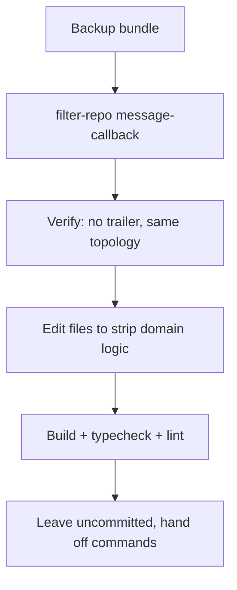

## Context

Four commits on `main` carry `Co-authored-by: Cursor <cursoragent@cursor.com>`: `db33b99`, `9b57bd4`, `960dbf6`, `b2c9685`. Author and email are already yours; only the trailer needs removing. No other branch contains them, and the working tree is clean.

On the rule: [.cursor/rules/no-agent-commits.mdc](.cursor/rules/no-agent-commits.mdc) was created at 03:04, so `b2c9685` (03:15) violated it outright. The three earlier commits predate the rule but were never requested either. After this task I will not run `git commit`, `add`, `push`, or `tag`; the edits below are left uncommitted with the exact commands handed to you.

## Order of operations

History rewrite first, while the tree is clean - `git filter-repo` refuses to run with uncommitted changes.



## Phase 1 - Rewrite the four commit messages

I will ask for one explicit confirmation before running this, since it writes history.

1. Safety net (the earlier folder backup predates these commits):

```powershell
git bundle create ../portfolio-pre-msg-rewrite.bundle --all
```

2. Strip the trailer from every commit message:

```powershell
git filter-repo --force --message-callback 'return b"\n".join([l for l in message.split(b"\n") if b"Co-authored-by: Cursor" not in l]).rstrip() + b"\n"'
```

Only the four commits change; their subjects and bodies stay identical otherwise. Fallback if PowerShell quoting fights the inline Python: write the callback body to a temp `.py` and pass it via `--message-callback "$(Get-Content cb.py -Raw)"`.

3. Verify:

```powershell
git log --all --grep='Co-authored' --oneline   # must be empty
git log -n 5 --format='%h %s'
git branch                                      # all 5 branches intact
```

## Phase 2 - Remove the domain and CNAME machinery

### [.github/workflows/deploy.yml](.github/workflows/deploy.yml)

Delete the `Resolve site URL and base path` step and the `PAGES_SITE_URL` env entry. `actions/configure-pages` already exposes what is needed (`base_path` is `"/my-repo"` or `""`), so the build step becomes:

```yaml
      - name: Configure Pages
        id: pages
        uses: actions/configure-pages@v5

      - name: Build
        env:
          VITE_SUPABASE_URL: ${{ secrets.VITE_SUPABASE_URL }}
          VITE_SUPABASE_ANON_KEY: ${{ secrets.VITE_SUPABASE_ANON_KEY }}
          VITE_ADMIN_BASE_PATH: ${{ secrets.VITE_ADMIN_BASE_PATH }}
          PAGES_BASE_PATH: ${{ steps.pages.outputs.base_path }}
        run: npm run build
```

No `vars.PAGES_SITE_URL` anywhere. Nothing domain-aware remains in CI.

### Postbuild script

Delete [scripts/finalize-pages-build.mjs](scripts/finalize-pages-build.mjs) and restore the original three-line [scripts/copy-spa-fallback.mjs](scripts/copy-spa-fallback.mjs):

```js
import { copyFileSync } from 'node:fs';

copyFileSync('dist/index.html', 'dist/404.html');
```

Point `postbuild` in [package.json](package.json) back at it. This drops CNAME generation, sitemap rewriting, and robots rewriting in one go.

### [vite.config.ts](vite.config.ts)

Keep `resolveBasePath()` (it consumes `base_path` and normalizes `""` to `/`), reword its comment so it describes only the Pages subpath, with no mention of domains.

### Untouched, per your decisions

- [public/sitemap.xml](public/sitemap.xml) and [public/robots.txt](public/robots.txt) stay exactly as they are.
- [src/lib/seo.ts](src/lib/seo.ts), [src/components/layout/Seo.tsx](src/components/layout/Seo.tsx), and [src/features/admin/preview/PreviewViewport.tsx](src/features/admin/preview/PreviewViewport.tsx) keep deriving the origin at runtime.
- `public/CNAME` stays deleted and is not reintroduced.

## Phase 3 - Documentation

- [README.md](README.md): drop the "Moving to a custom domain later" section, all `PAGES_SITE_URL` and CNAME references, and the DNS record list. Keep a short deployment section: set Pages source to GitHub Actions, add the three `VITE_*` environment secrets, run the workflow with a `ref`.
- [docs/deployment.md](docs/deployment.md): delete section 6 (custom domain) entirely, the CNAME explanation in section 2, section 5.3, and the domain-related troubleshooting entries. Renumber the remaining sections and fix the contents list and internal anchors.
- [.env.example](.env.example): remove the `PAGES_SITE_URL` / `PAGES_BASE_PATH` comment block.

Worth noting for the future: with Pages source set to GitHub Actions, a custom domain is configured in Settings and persists there - no `CNAME` file in the artifact is required. Nothing in the repo needs to change if you add a domain later.

## Phase 4 - Verify, then hand off

```powershell
npx tsc -b
npm run lint
npm run build            # root build
$env:PAGES_BASE_PATH='/test-repo/'; npm run build   # subpath build
```

Confirm `dist/404.html` exists in both, that no `dist/CNAME` is produced in either, and that asset URLs carry the right prefix. Then reset the env var and free any ports used.

I will leave everything uncommitted and give you the commands:

```powershell
git status
git add -A
git commit -m "chore: simplify github pages deploy"
```
