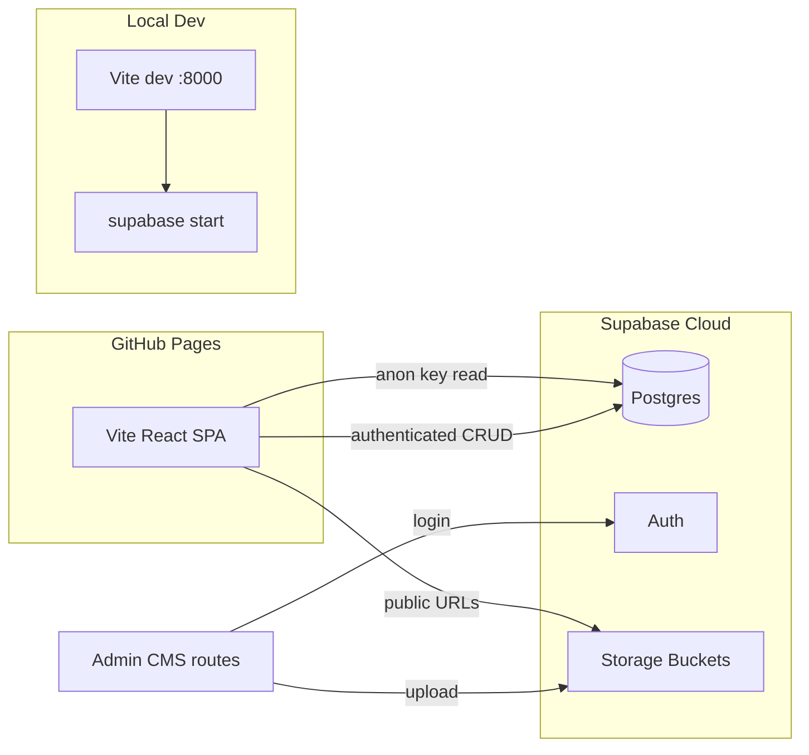

# Supabase Backend for Portfolio Monorepo

## Decisions locked in

| Topic | Choice |
|---|---|
| Database | **Supabase Postgres** (not MongoDB/Docker Compose) |
| Dev | `npx supabase start` (local stack) |
| Prod | Linked Supabase cloud project |
| API | **Direct Supabase client** from React - no Express/Node server |
| Auth | **Supabase Auth** (email/password admin) |
| Media | **Supabase Storage** buckets (replaces `src/assets/` imports for portfolio media) |
| Public site data | **API-only** at runtime via React Query |
| Frontend deploy | **GitHub Pages** (static SPA calling Supabase cloud) |
| Admin route | **Env-configurable** obscure path (`VITE_ADMIN_BASE_PATH`) |

## Architecture



**Why this fits "no separate server":** Supabase *is* the backend. The React app uses `@supabase/supabase-js` with RLS-enforced Postgres and Storage policies. GitHub Pages only serves static JS/CSS; all data lives in Supabase.

---

## 1. Supabase project scaffolding

Add to repo root:

```
supabase/
  config.toml          # from `npx supabase init`
  migrations/
    <timestamp>_portfolio_schema.sql
  seed.sql             # optional SQL seed; prefer TS seed script for media uploads
scripts/
  seed-portfolio.ts    # one-time + repeatable seed from current static content
```

**New npm scripts** in [`package.json`](package.json):

- `db:start` → `supabase start`
- `db:stop` → `supabase stop`
- `db:reset` → `supabase db reset` (migrations + seed)
- `db:seed` → `tsx scripts/seed-portfolio.ts`
- `db:push` → `supabase db push` (prod migrations)

**Env template** - create [`.env.example`](.env.example) (never commit real `.env`):

```env
VITE_SUPABASE_URL=http://127.0.0.1:54321
VITE_SUPABASE_ANON_KEY=<local-anon-key-from-supabase-start>
VITE_ADMIN_BASE_PATH=/_sys/r7k9
```

Prod: same keys from linked Supabase cloud project, set as GitHub Actions secrets for build.

---

## 2. Database schema (Postgres)

Use a **hybrid model**: scalar columns for query/filter fields + `jsonb` for nested arrays (matches existing TS types in [`src/content/caseStudies/types.ts`](src/content/caseStudies/types.ts), [`src/content/resume.ts`](src/content/resume.ts)).

### Tables

| Table | Purpose | Key columns |
|---|---|---|
| `site_profile` | Singleton profile/about | `id` (fixed `'main'`), `data jsonb` |
| `site_settings` | Version, meta | `site_version`, `updated_at` |
| `case_studies` | All 14 case studies | `slug`, `category`, `sort_order`, `featured`, `status`, `data jsonb` |
| `technologies` | Tech library | `id`, `name`, `category`, `logo_path`, `description`, `used_in_slugs text[]` |
| `timeline_items` | Experience timeline | `id`, `sort_order`, `data jsonb` |
| `philosophy_pillars` | Philosophy section | `id`, `sort_order`, `data jsonb` |
| `resume_sections` | Resume blocks | `section` (enum), `sort_order`, `data jsonb` |
| `terminal_commands` | Terminal easter egg | `command`, `aliases text[]`, `data jsonb` |
| `contact_submissions` | Contact form inbox | `name`, `email`, `message`, `created_at` |

**`data jsonb` holds** nested structures already in static files: `stack`, `decisions`, `challenges`, `architectureNodes`, `gallery` (with storage paths), `relatedSlugs`, resume bullets, etc.

**Derived data stays computed client-side** (not stored):
- [`engineeringStats`](src/content/stats.ts) - computed from fetched case studies + technologies
- `usedInSlugs` on technologies - recomputed in seed script + admin save hook
- `categoryLabels` / `categoryPaths` - remain constants in code

### RLS policies (every table)

- **SELECT**: `true` for `anon` + `authenticated` (public portfolio is readable)
- **INSERT/UPDATE/DELETE**: `authenticated` only, optionally gated by `auth.jwt() -> 'app_metadata' ->> 'role' = 'admin'`
- **`contact_submissions`**: `INSERT` for `anon` (public form); `SELECT` only for `authenticated` admin

Run `supabase db advisors` after migration to catch security issues.

---

## 3. Storage buckets

| Bucket | Visibility | Contents |
|---|---|---|
| `portfolio-media` | Public read | Logos, covers, gallery images |
| `portfolio-resume` | Public read | `resume.pdf` |

**Path convention:**
```
portfolio-media/logos/{slug}.{ext}
portfolio-media/gallery/{slug}/{index}.{ext}
portfolio-media/tech/{id}.svg
portfolio-resume/resume.pdf
```

**Storage policies:**
- Public `SELECT` on both buckets
- `INSERT` / `UPDATE` / `DELETE` for `authenticated` admin only (remember: upsert needs INSERT + SELECT + UPDATE per Supabase security checklist)

**Seed step** uploads all files from [`src/assets/logos/`](src/assets/logos/) and gallery references in case study files, then writes storage paths into DB rows. Tech SVGs from [`src/assets/tech/`](src/assets/tech/) also upload so admin can replace them.

**Fonts** ([`src/assets/fonts/`](src/assets/fonts/)) stay bundled - not CMS content.

---

## 4. Seed all current static data

[`scripts/seed-portfolio.ts`](scripts/seed-portfolio.ts) will:

1. Import/read existing modules from [`src/content/`](src/content/) (profile, case studies, technologies, timeline, philosophy, resume, terminal)
2. Upload binary assets to Supabase Storage (local or linked project via env)
3. Replace Vite import URLs with `getPublicUrl(storagePath)` strings in seeded records
4. Upsert all rows (idempotent - safe to re-run)

This guarantees the live site matches today's content after first seed.

**Admin user:** create via Supabase dashboard or `supabase auth admin create-user` with `app_metadata: { role: 'admin' }`.

---

## 5. Frontend data layer

### New dependencies

- `@supabase/supabase-js`
- `@tanstack/react-query`
- `zod` (validate API responses at boundaries)

### New files

| File | Role |
|---|---|
| [`src/lib/supabase.ts`](src/lib/supabase.ts) | Supabase client singleton |
| [`src/lib/env.ts`](src/lib/env.ts) | Typed `import.meta.env` access |
| [`src/types/portfolio.ts`](src/types/portfolio.ts) | Shared types (moved from content modules) |
| [`src/services/portfolio.ts`](src/services/portfolio.ts) | Fetch/mutate functions |
| [`src/hooks/usePortfolio.ts`](src/hooks/usePortfolio.ts) | React Query hooks: `useProfile`, `useCaseStudies`, `useTechnologies`, etc. |
| [`src/providers/PortfolioProvider.tsx`](src/providers/PortfolioProvider.tsx) | `QueryClientProvider` wrapper in [`src/main.tsx`](src/main.tsx) |

### Refactor strategy

Replace direct `@/content` imports in ~30 consumer files with hooks. Pattern:

```tsx
// Before
import { profile } from '@/content/profile'

// After
const { data: profile, isLoading } = useProfile()
```

**Loading UX:** reuse existing `RouteFallback` / add section skeletons so API-only doesn't flash empty content.

**Keep in repo (not deleted immediately):**
- [`src/content/`](src/content/) as **seed source of truth** until seed is verified; then mark deprecated or remove in a follow-up
- Constants: `categoryLabels`, `categoryPaths`, SEO helpers

**Contact form** ([`src/features/contact/ContactPanel.tsx`](src/features/contact/ContactPanel.tsx)): replace `mailto:` with `supabase.from('contact_submissions').insert(...)` + success/error UI.

---

## 6. Admin panel (obscured CMS)

### Routing

Add lazy routes in [`src/app/router.tsx`](src/app/router.tsx) under `VITE_ADMIN_BASE_PATH`:

```
{VITE_ADMIN_BASE_PATH}/login
{VITE_ADMIN_BASE_PATH}           → dashboard (auth guard)
{VITE_ADMIN_BASE_PATH}/profile
{VITE_ADMIN_BASE_PATH}/case-studies
{VITE_ADMIN_BASE_PATH}/case-studies/:slug
{VITE_ADMIN_BASE_PATH}/technologies
{VITE_ADMIN_BASE_PATH}/timeline
{VITE_ADMIN_BASE_PATH}/philosophy
{VITE_ADMIN_BASE_PATH}/resume
{VITE_ADMIN_BASE_PATH}/terminal
{VITE_ADMIN_BASE_PATH}/submissions
{VITE_ADMIN_BASE_PATH}/media
```

- **Not linked** from [`navItems.ts`](src/components/layout/navItems.ts) or sitemap
- **`robots.txt`** updated to `Disallow` admin path prefix

### Auth guard

[`src/features/admin/AdminGuard.tsx`](src/features/admin/AdminGuard.tsx):
- Uses `supabase.auth.getSession()` / `onAuthStateChange`
- Redirects unauthenticated users to `{ADMIN_BASE_PATH}/login`
- Login page: email + password form via `supabase.auth.signInWithPassword`

### Admin UI scope (all data-related content)

| Section | Capabilities |
|---|---|
| Profile & settings | Edit profile JSON, site version |
| Case studies | List/create/edit/delete; nested fields; image upload for logo/cover/gallery |
| Technologies | CRUD + logo upload |
| Timeline | CRUD ordered items |
| Philosophy | CRUD pillars |
| Resume | Edit each resume section |
| Terminal | Edit commands/aliases/responses |
| Submissions | Read-only inbox for contact form |
| Media | Browse/upload/delete storage files |

Use existing shadcn components ([`src/components/ui/`](src/components/ui/)) for forms, tables, dialogs. Keep forms practical (textareas for long copy) - no rich-text editor in v1.

---

## 7. Dev workflow

```bash
# Terminal 1
npx supabase start

# Terminal 2
cp .env.example .env   # fill keys from `supabase status`
npm run db:seed        # first time + after content changes in static files
npm run dev            # Vite on :8000
```

Local Supabase Studio: `http://127.0.0.1:54323`

**Prod sync:**
```bash
supabase link --project-ref <ref>
supabase db push
npm run db:seed        # against prod env vars (document clearly)
```

---

## 8. GitHub Pages CI update

Update [`.github/workflows/deploy.yml`](.github/workflows/deploy.yml):

- Add build-time secrets: `VITE_SUPABASE_URL`, `VITE_SUPABASE_ANON_KEY`, `VITE_ADMIN_BASE_PATH`
- Pass as `env:` to `npm run build`

No server deploy needed - SPA calls Supabase cloud directly.

---

## 9. What stays unchanged

- Vite + React Router architecture
- GitHub Pages static deploy model
- shadcn/Tailwind design system
- Lazy-loaded public pages
- Font bundling in `src/assets/fonts/`

## 10. Risks and mitigations

| Risk | Mitigation |
|---|---|
| GitHub Pages build without Supabase secrets → broken site | Fail build if env vars missing; document required secrets |
| RLS misconfiguration exposes write access | Advisors check + admin-only write policies + test with anon client |
| API-only = blank site while loading | App-level loading shell + React Query `staleTime` caching |
| Large seed with binary uploads | Idempotent seed script; progress logging |
| Admin path discoverable | Auth is real security; obscure path is extra obscurity only |

---

## Implementation order

1. Supabase init + schema migration + storage buckets + RLS
2. Seed script (static content → DB + Storage)
3. Supabase client + React Query hooks
4. Refactor public pages to use hooks (verify parity with current site)
5. Admin auth + CRUD panels
6. Contact form → DB
7. CI secrets + `.env.example` + README dev setup section
