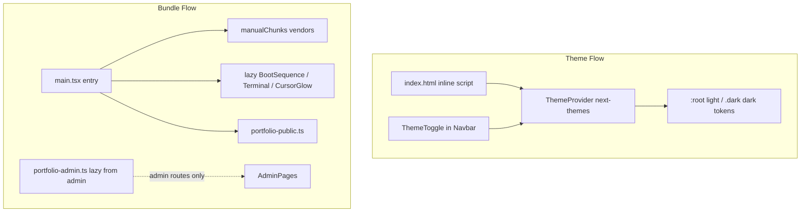

# Theme Toggle + Production Optimization Plan

## Current State

- **Dark-only UI**: All tokens live in `:root` in [`src/index.css`](src/index.css) with dark values; `<html class="dark">` is hardcoded in [`index.html`](index.html).
- **Infrastructure ready**: `@custom-variant dark`, shadcn `dark:` variants, and semantic utilities (`bg-background`, `text-foreground`, brand tokens) are already used widely.
- **Gaps**: No theme provider/toggle, hardcoded rgba/hex in [`src/lib/cardGradients.ts`](src/lib/cardGradients.ts), body gradients, `.overlay-hero-scrim`, [`CursorGlow.tsx`](src/components/effects/CursorGlow.tsx), and admin login.
- **Bundle**: Main entry ~609 KB (189 KB gzip); ~5 MB font assets; monolithic [`src/services/portfolio.ts`](src/services/portfolio.ts) pulled into public path via [`usePortfolio.ts`](src/hooks/usePortfolio.ts).



---

## Part 1 — Theme Token Architecture

Refactor [`src/index.css`](src/index.css) to a **three-layer token model** (per design-system skill):

| Layer | Location | Purpose |
|-------|----------|---------|
| Primitive | Shared vars | Brand hues: `--electric-blue`, `--deep-purple`, `--soft-cyan` (unchanged) |
| Semantic light | `:root` | shadcn tokens tuned for light surfaces |
| Semantic dark | `.dark` | Move current `:root` values here |

**Light palette direction** (matching brand, WCAG AA):
- Background: `#f8fafc` / surface `#ffffff` / card `#f1f5f9`
- Foreground: `#0f172a` / muted: `#64748b`
- Borders/inputs: slate with ~12–16% opacity
- Brand accents: same `#3b82f6`, `#7c3aed`, `#22d3ee` — adjust `--accent-foreground` per theme for contrast
- Scrollbar/scrim/glow tokens: theme-specific CSS vars (not hardcoded rgba)

**Theme-aware effect tokens** (new semantic vars):
```css
--bg-glow-blue: ...;
--bg-glow-purple: ...;
--bg-glow-cyan: ...;
--selection-bg: ...;
--hero-scrim-from: ...;
--hero-scrim-mid: ...;
--card-surface-from: ...;
--card-surface-to: ...;
```

Update `@layer base` body radial gradients, `::selection`, and `.overlay-hero-scrim` to reference these vars in both `:root` and `.dark`.

Add global theme transition (subtle, GPU-safe):
```css
html {
  color-scheme: light dark;
  transition: background-color 200ms ease-out, color 200ms ease-out;
}
@media (prefers-reduced-motion: reduce) {
  html { transition: none; }
}
```
Only transition `background-color` / `color` on `html` — not `*` (avoids jank).

---

## Part 2 — Theme Provider and Toggle

### Install `next-themes`
```bash
npm install next-themes
npm audit && npm audit fix
```

### New files

**[`src/components/theme/ThemeProvider.tsx`](src/components/theme/ThemeProvider.tsx)**
- Wrap children with `next-themes` `ThemeProvider`
- Config: `attribute="class"`, `defaultTheme="dark"`, `enableSystem`, `storageKey="portfolio-theme"`, `disableTransitionOnChange={false}`

**[`src/components/theme/ThemeToggle.tsx`](src/components/theme/ThemeToggle.tsx)**
- Icon button (Sun / Moon / Monitor from `lucide-react`) cycling Light → Dark → System
- `aria-label="Toggle theme"`, 44×44px touch target
- Subtle animation: CSS `transform` + `opacity` crossfade on icon swap (~200ms ease-out); skip animation when `usePrefersReducedMotion()` is true
- Use existing [`Button`](src/components/ui/button.tsx) `variant="ghost"` `size="icon"`

**[`src/hooks/useThemeMeta.ts`](src/hooks/useThemeMeta.ts)** (optional small hook)
- Sync `<meta name="theme-color">` via `react-helmet-async` in [`Seo.tsx`](src/components/layout/Seo.tsx) or AppShell: `#050816` dark / `#f8fafc` light

### Wire up

**[`src/main.tsx`](src/main.tsx)** — wrap `RouterProvider` with `ThemeProvider`.

**[`index.html`](index.html)** — remove hardcoded `class="dark"`; add inline FOUC-prevention script (before `<body>`) that reads `localStorage['portfolio-theme']` and applies `class="dark"` or removes it before first paint. Default to dark when unset.

**[`src/components/layout/Navbar.tsx`](src/components/layout/Navbar.tsx)** — add `<ThemeToggle />` in desktop actions row and mobile sheet footer (alongside terminal button).

---

## Part 3 — Theme-Aware Hardcoded Colors

| File | Change |
|------|--------|
| [`src/lib/cardGradients.ts`](src/lib/cardGradients.ts) | Replace fixed `rgba(17,24,39,...)` bases with CSS-var-driven approach: export a `getCardGradient(key)` that returns Tailwind arbitrary values using `var(--card-surface-from)` etc., or move gradients to CSS classes in `index.css` under `.dark` / `:root` |
| [`src/components/effects/CursorGlow.tsx`](src/components/effects/CursorGlow.tsx) | Use `color-mix(in oklch, var(--electric-blue) …)` pattern (already used in MagneticButton) |
| [`src/components/effects/BackgroundEffects.tsx`](src/components/effects/BackgroundEffects.tsx) | Replace fixed grid rgba with `var(--border)` or new `--grid-line` token |
| [`src/pages/admin/AdminLoginPage.tsx`](src/pages/admin/AdminLoginPage.tsx) | Replace inline rgba gradient with semantic tokens |

Quick audit pass with ripgrep for `rgba(59,130,246`, `rgb(5 8 22`, `#050816` outside `index.css` — convert remaining hits.

---

## Part 4 — Subtle Theme Animations (CSS-only)

Per design-animate skill — no new JS animation libraries:

1. **Toggle icon**: rotate ±15° + opacity crossfade on theme change (200ms)
2. **Navbar glass**: existing `transition-colors` — no change needed
3. **No** page-wide View Transitions API for theme switch (adds complexity, minimal UX gain)
4. **Respect** [`usePrefersReducedMotion`](src/hooks/usePrefersReducedMotion.ts) in ThemeToggle

---

## Part 5 — Production Modularization and Optimization

### 5a. Vite build splitting — [`vite.config.ts`](vite.config.ts)

```ts
build: {
  rollupOptions: {
    output: {
      manualChunks: {
        'vendor-react': ['react', 'react-dom', 'react-router-dom'],
        'vendor-query': ['@tanstack/react-query'],
        'vendor-motion': ['framer-motion'],
        'vendor-supabase': ['@supabase/supabase-js'],
      },
    },
  },
  chunkSizeWarningLimit: 600,
},
```

Add devDep `rollup-plugin-visualizer` + script `"build:analyze": "tsc -b && vite build --mode prod && ..."`.

**Target**: main entry under ~350 KB raw / ~120 KB gzip.

### 5b. Split portfolio service

| New file | Contents |
|----------|----------|
| [`src/services/portfolio-public.ts`](src/services/portfolio-public.ts) | `fetchPublicPortfolio`, `submitContact`, minimal zod schemas |
| [`src/services/portfolio-admin.ts`](src/services/portfolio-admin.ts) | All admin upsert/delete/upload functions |
| [`src/services/portfolio.ts`](src/services/portfolio.ts) | Re-export barrel (admin imports unchanged) OR update admin imports directly |

Update [`src/hooks/usePortfolio.ts`](src/hooks/usePortfolio.ts) and [`ContactPanel.tsx`](src/features/contact/ContactPanel.tsx) to import from `portfolio-public.ts` only.

### 5c. Lazy-load non-critical AppShell weight — [`src/app/AppShell.tsx`](src/app/AppShell.tsx)

```ts
const BootSequence = lazy(() => import('@/components/layout/BootSequence').then(m => ({ default: m.BootSequence })));
const CommandTerminal = lazy(() => import('@/components/terminal/CommandTerminal').then(m => ({ default: m.CommandTerminal })));
const CursorGlow = lazy(() => import('@/components/effects/CursorGlow').then(m => ({ default: m.CursorGlow })));
```

Render shell skeleton (navbar + outlet) while portfolio loads instead of full-screen "Loading systems...".

### 5d. Font optimization — [`src/index.css`](src/index.css)

- Remove duplicate `@fontsource/jetbrains-mono` imports if Nerd Font covers terminal UI
- Load Nerd Font TTFs via dynamic `@font-face` injection when terminal opens, OR convert to woff2 subset (~90% size reduction)
- Restrict `@fontsource-variable/inter` and `space-grotesk` to `latin` subset if not already

**Target**: eliminate ~2.5 MB duplicate JetBrains load from initial CSS.

### 5e. Admin page modularity (lower priority, same PR if time permits)

Split [`AdminContentPages.tsx`](src/pages/admin/AdminContentPages.tsx) (~1143 lines, 5 routes) into one file per route so each admin page gets its own lazy chunk.

### 5f. Fix ESM postbuild — [`package.json`](package.json)

Replace `require('fs')` in `postbuild` with a small `scripts/copy-spa-fallback.mjs` (project is `"type": "module"`).

---

## Part 6 — Verification Checklist

- [ ] Toggle cycles Light / Dark / System; default is Dark on first visit
- [ ] Preference persists in `localStorage`; no FOUC flash
- [ ] Both themes: navbar, cards, hero, admin login, forms readable (4.5:1 body text)
- [ ] Brand gradient accents visible in both modes
- [ ] `prefers-reduced-motion: reduce` disables toggle animation
- [ ] `npx tsc -b` clean; `npm run build` succeeds; `npm audit` = 0
- [ ] Main bundle size reduced; fonts no longer block initial load with 5 MB TTFs
- [ ] No regressions on admin routes, contact form, boot sequence, terminal

---

## Implementation Order

1. Token refactor (`index.css`) — foundation for everything else
2. ThemeProvider + FOUC script + ThemeToggle in Navbar
3. Hardcoded color migration (cardGradients, effects, scrim)
4. Service split + AppShell lazy loading
5. Vite chunk config + font optimization
6. Build verify + visual pass both themes at 375px and 1280px
