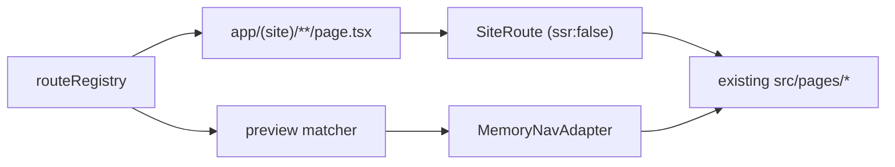

# Vite to Next.js (static export, exact clone)

## Constraints driving the design

- Static only: `output: 'export'`, `images.unoptimized`, no middleware, no route handlers, no server components doing data work. Supabase stays the only backend, called from the browser exactly as today.
- Zero visual/behavioural drift: every page keeps its current client-side render path. Rendering is driven by TanStack Query on the client, so the prerendered HTML is just the shell — same as today's `index.html`.
- Side-by-side build in a new `next/` folder; the Vite app at the repo root stays runnable for A/B comparison, then we swap at the end.

## Parity strategy (the important decision)

Today every page renders only after `usePublicPortfolioQuery()` resolves in the browser, with `PageRouteSkeleton` before that. To guarantee no pixel or timing difference, we do **not** move data fetching to build time. Each Next route file is a thin server wrapper that renders the existing page through a client-only boundary:

```tsx
// next/src/app/(site)/about/page.tsx
import { SiteRoute } from '@/app/site/SiteRoute';
export default function Page() {
  return <SiteRoute route="about" />;
}
```

`SiteRoute` is `'use client'` and pulls the page via `next/dynamic(..., { ssr: false })`. Result: exported HTML contains the same empty shell the Vite build ships, so there is no hydration mismatch and no chance of a different first paint — while Next still gives per-route file-based splitting, `<Link>` prefetch on viewport/hover, and real static HTML per URL.

This also neutralises every SSR hazard found in the audit (`shouldShowBootSequence()` in a `useState` initializer, module-scope `createClient`, `next-themes`, `framer-motion` `AnimatePresence`, `document.startViewTransition`) without editing their logic.

## Routing map (file-based, 1:1 with today)

```
next/src/app/
  layout.tsx                    <- replaces index.html (meta, inline theme script, index.css)
  (site)/layout.tsx             <- renders AppShell chrome (Navbar/Footer/boot/terminal), client-only
  (site)/page.tsx                       /
  (site)/about/page.tsx                 /about
  (site)/platforms/page.tsx             /platforms
  (site)/platforms/[slug]/page.tsx      /platforms/:slug        + generateStaticParams
  (site)/infrastructure/page.tsx        + [slug]/
  (site)/automation/page.tsx            + [slug]/
  (site)/technology-library/page.tsx
  (site)/philosophy|experience|resume|contact/page.tsx
  (site)/404/page.tsx                   /404 (explicit route, as today)
  (site)/work/page.tsx, work/[slug]/page.tsx        <- client redirect to /platforms[/slug]
  (site)/projects/page.tsx, projects/[slug]/page.tsx
  (site)/skills/page.tsx                            <- client redirect to /about
  not-found.tsx                 <- emits out/404.html; GitHub Pages serves it for unknown URLs,
                                   it redirects to /404 to match today's `path: '*'` behaviour
```

Admin tree (currently `/_sys/r7k9`, react-router children in [src/app/router.tsx](src/app/router.tsx)) becomes real Next routes. Underscore folders are private in Next, so the literal segment is written `%5Fsys`:

```
next/src/app/%5Fsys/r7k9/
  login/page.tsx
  layout.tsx                    <- AdminGuard + AdminDataLayout + AdminLayout, client-only
  page.tsx  profile/  case-studies/  case-studies/[slug]/  technologies/
  timeline/  philosophy/  resume/  terminal/  submissions/  media/
```

Note: with static export the admin path must be fixed at build time, so `VITE_ADMIN_BASE_PATH` becomes a build-time constant (`getAdminBasePath()` keeps returning `/_sys/r7k9`) rather than a runtime env override. `case-studies/[slug]` gets `generateStaticParams` from a build-time anon Supabase read plus `'new'`; a postbuild step copies the `new` HTML to a `[slug]` fallback so a freshly created slug still deep-links.

`generateStaticParams` for public `[slug]` routes reads case-study slugs at build time with the anon key (same data as [src/services/portfolio-public.ts](src/services/portfolio-public.ts)), falling back to the static slugs in [src/content/caseStudies/index.ts](src/content/caseStudies/index.ts) if env is absent. `trailingSlash: true` so GitHub Pages serves `/about/index.html` correctly.

## Removing react-router without touching component internals

26 files import `react-router-dom`, mostly just `Link`. We add a compat layer `next/src/lib/nav/` exporting `Link`, `NavLink`, `useLocation`, `useNavigate`, `useParams`, `Navigate`, `Outlet` with the same call signatures, backed by a `NavAdapter` context:

- `NextNavAdapter` (default): `next/link`, `usePathname`, `useRouter`, `useParams`.
- `MemoryNavAdapter`: in-memory path state, used by the admin preview workbench so preview links stay inside the viewport exactly as `MemoryRouter` does today.

Then each consumer's import specifier changes from `'react-router-dom'` to `'@/lib/nav'` — no JSX or prop changes. `NavLink`'s `className={({ isActive }) => ...}` render-prop shape is reimplemented in the compat `NavLink`, so [src/components/layout/Navbar.tsx](src/components/layout/Navbar.tsx) and [src/features/admin/AdminLayout.tsx](src/features/admin/AdminLayout.tsx) are untouched apart from the import. `react-router-dom` is dropped from dependencies.

[src/features/admin/preview/previewRoutes.tsx](src/features/admin/preview/previewRoutes.tsx) currently reuses `publicChildRoutes` via `useRoutes`. It is replaced by a small pattern matcher fed from a shared registry (`next/src/app/site/routeRegistry.ts`) that maps each public path pattern to its lazy page component. The Next route files and the preview matcher both read that one registry, so preview and live site can never diverge.



## Env, base path, SEO

- `import.meta.env.VITE_*` -> `process.env.NEXT_PUBLIC_*` in [src/lib/env.ts](src/lib/env.ts); `.env.example` updated to `NEXT_PUBLIC_SUPABASE_URL` / `NEXT_PUBLIC_SUPABASE_ANON_KEY`.
- `import.meta.env.BASE_URL` (used in [src/lib/seo.ts](src/lib/seo.ts) and `router.tsx`) -> a `BASE_PATH` constant from `process.env.NEXT_PUBLIC_BASE_PATH`, wired to `next.config.ts` `basePath`/`assetPrefix` from `PAGES_BASE_PATH` so the existing GitHub Pages subpath logic keeps working.
- Supabase client becomes a lazy singleton getter so build-time module evaluation never throws.
- `react-helmet-async` and [src/components/layout/Seo.tsx](src/components/layout/Seo.tsx) stay as-is (client-side titles, identical to today). No `generateMetadata` is added, since that would change the initial document title and count as a diff.
- `public/robots.txt` and `public/sitemap.xml` copied verbatim; `next/src/app/layout.tsx` reproduces every tag and the inline `localStorage` theme script from `index.html` byte-for-byte, with `suppressHydrationWarning` on `<html>`.

## Tooling

- `next/package.json`: next (latest stable), react 19.2, react-dom, existing runtime deps minus `react-router-dom`; scripts `dev` (`next dev -p 8000`), `build` (`next build`), `postbuild` (404/admin fallback copies), `lint` (oxlint), `typecheck` (`tsc --noEmit`). `npm audit` must report 0 after install.
- Tailwind v4 keeps `@import 'tailwindcss'` in `src/index.css`; swap `@tailwindcss/vite` for `@tailwindcss/postcss` with a `postcss.config.mjs`. No token or CSS edits.
- tsconfig: Next-flavoured (`jsx: preserve`, `moduleResolution: bundler`, `next-env.d.ts`, `@/*` -> `./src/*`), dropping `vite/client` types and `vite-env.d.ts`.
- `.github/workflows/deploy.yml`: build with `NEXT_PUBLIC_*` secrets and `PAGES_BASE_PATH`, upload `out/` instead of `dist/`, keep the `404.html` assertion.

## Verification before swap

1. `npx tsc --noEmit` and `npx oxlint` clean in `next/`.
2. `next build` succeeds and `out/` contains an `index.html` for all 20 public URLs plus `404.html`.
3. Run Vite on 8000 and Next on 8001, walk every route in both, and diff DOM structure and computed styles at desktop and mobile widths; confirm boot sequence, theme toggle + view transition, konami dev badge, command terminal, scroll restoration, lightbox, contact submit, admin login/guard, media upload, resume activation, and the preview workbench all behave the same.
4. Only after that: move `next/*` to the repo root, delete `vite.config.ts`, `index.html`, `src/main.tsx`, `src/app/router.tsx`, `src/app/publicRoutes.tsx`, `scripts/copy-spa-fallback.mjs`, and the Vite deps; update `README.md`.

Nothing is committed — I'll leave the tree dirty with the exact commands for you to run.